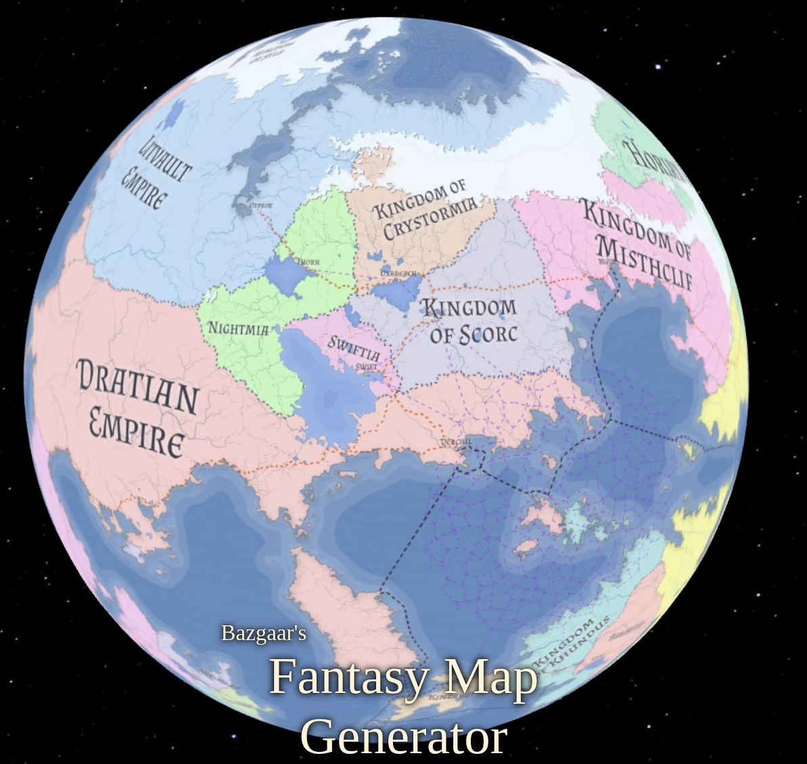
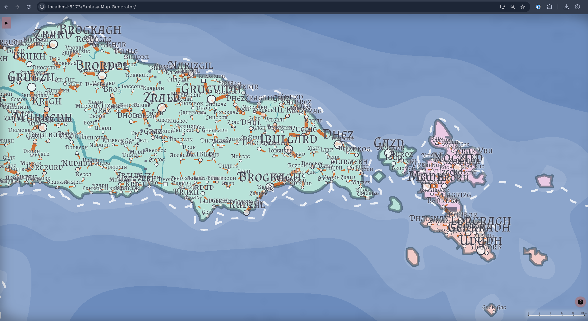
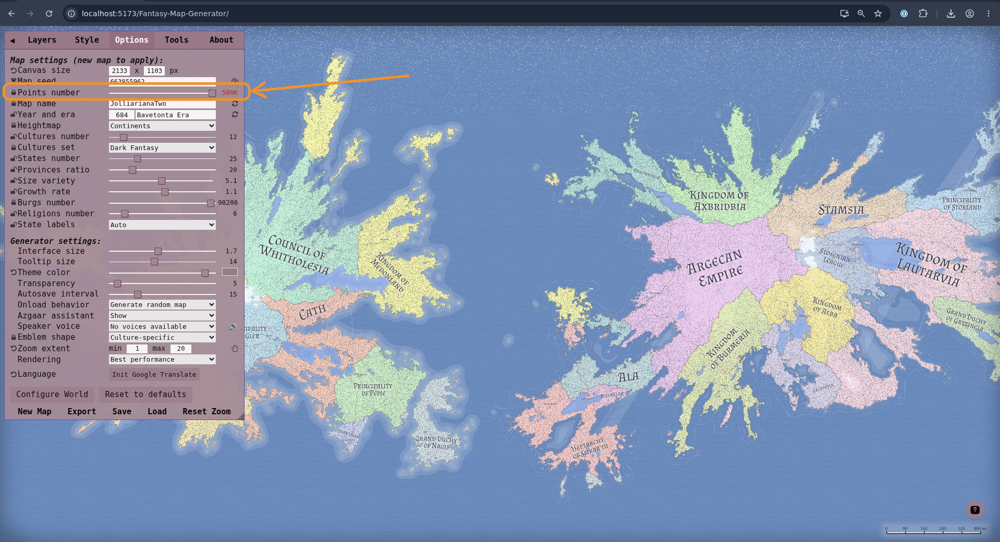
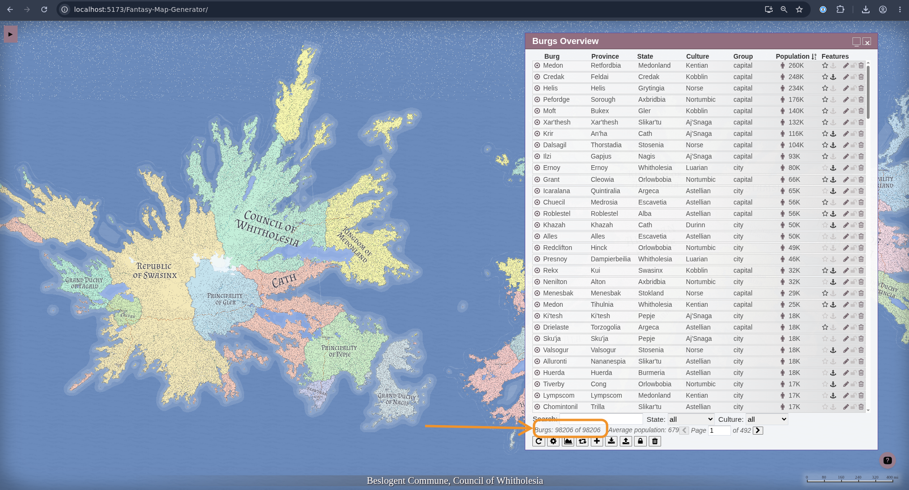
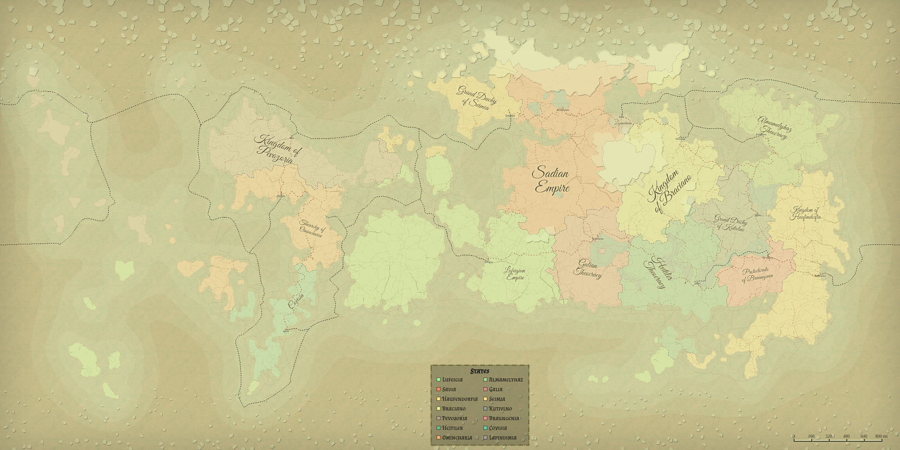
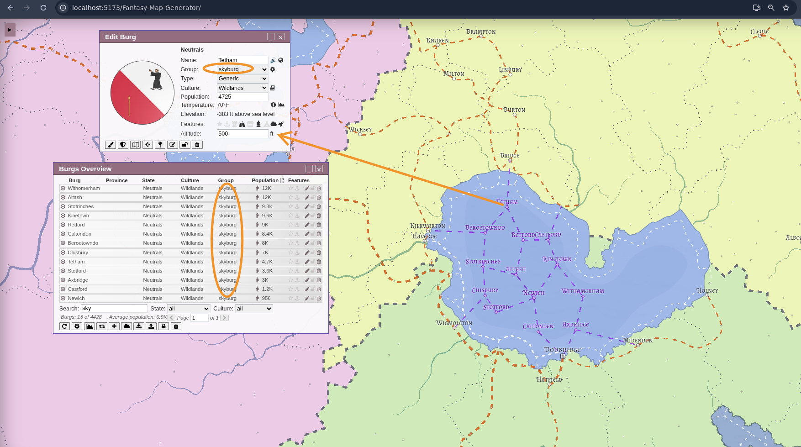

# Fantasy Map Generator (barrulus fork)

A fork of [Azgaar's Fantasy Map Generator](https://github.com/Azgaar/Fantasy-Map-Generator) focused on **larger, denser worlds**: half-million-cell heightmaps, tens of thousands of settlements, a simulated trade network, and globe-aware routing — while staying compatible with upstream `.map` files.

Upstream docs still apply for the basics: [wiki](https://github.com/Azgaar/Fantasy-Map-Generator/wiki) · [data model](https://github.com/Azgaar/Fantasy-Map-Generator/wiki/Data-model).



## Hierarchical settlements & population

Upstream places capitals and then scatters generic towns by cell suitability. This fork replaces that with a **seven-tier hierarchical placement pass**, each tier filling in around the one above it with its own spacing rules:

**capital → large port → regional centre → market town → large village → small village → hamlet**

- Spacing is culture-aware, so settlement density follows cultural geography rather than a uniform grid.
- Large ports are promoted from strategically placed harbours; regional centres are seeded between primary centres (capitals + large ports) rather than at random.
- Each tier draws population from its own gaussian range (in upstream population units, × population rate for people): capitals 10k–200k, large ports 5k–50k, regional centres and market towns 1k–10k, large villages 200–1k, small villages 50–500, hamlets 10–50.
- Population is then modified by **route connectivity** — well-connected burgs grow, isolated ones stay small.
- Features (citadel, plaza, walls, temple…) and coat-of-arms generation are driven by tier, not just raw population.
- A bug that silently dropped the entire hamlet tier at high target counts is fixed, so dense maps actually get the hamlets they ask for.



## High cell counts (up to 500K)

The heightmap pipeline now produces proper continents at every density the slider exposes:

- The `blobPower`/`linePower` tables capped at 100k cells upstream — anything above silently reused the 10k value and continents collapsed into scattered specks. The tables now extend through 500k.
- Hill/blob shape operations scale their **op counts** with cell count instead of capping BFS depth, so terrain features keep their intended footprint at any density (fractional template syntax like `Hill 0.5` still works).
- New heightmap tooling: a `Power` template step exposing elevation-curve compression, flatten-first elevation distribution for the continents/oldWorld/pangea templates, and a `globeWorld` template that produces ocean-edged worlds suitable for globe rendering.



## Performance at scale

A 500K-cell map with ~100K burgs generates in ~12 seconds. Getting there required fixing a series of hot paths that upstream never hits at default densities:

- **Generation:** culture and state expansion BFS rewritten to kill GC pressure and stale queue work; cost arrays use `Float64Array` (Float32 silently broke priority-queue staleness checks); deep-depression lake filling rewritten as an O(N log N) priority flood; route lookups (`getRoute`/`hasRoad`/`isCrossroad`) moved from linear scans to O(1) `Map` lookups; old pack buffers are released before regeneration to avoid out-of-memory SIGILLs at high densities.
- **Rendering & UI:** burg icons and anchors are culled at low zoom; sky burgs are tiered by population for zoom culling; the map hover tooltip short-circuits when the hovered cell hasn't changed.
- **Editors:** the burgs, states, cultures, religions, rivers, and routes overview dialogs are **paginated** (200 rows per page). Upstream rendered every row at once — with ~20K burgs the dialog froze the UI on open. Sort, filter, and CSV export operate across the full filtered set, not just the visible page.



## Trade routes

Sea routes are no longer a simple nearest-neighbour graph. Two systems layer together:

**Gravity maritime network.** Every port gets an importance score (population weighted by settlement role). Routes are selected by a gravity model (importance × importance / distance²) in three tiers — trunk lanes between major ports, regional feeders (each major port connects to its top gravity partners within ~300 km), and short coastal hops (≤120 km Urquhart pairs). Gravity selection is bounded to the top ports per navigable ocean component, so it stays tractable with tens of thousands of ports, and pathfinding uses multi-target Dijkstra for the feeder tier.

**Global trade hub network.** On top of the lanes, burgs are assigned trade roles: each state gets one **hub** (the qualifying port nearest its capital) and other large ports become **waystations**. Hubs are linked through a leg graph (same ocean component, within one leg's range) with multi-hop routing and per-leg usage counts, rendered as a dedicated `traderoutes` layer. Legs with no coastal path fall back to routing offshore through deep water. Roles can be overridden per-burg and survive regeneration.



## Globe-aware (seam-wrapping) routes

On full-globe maps (360° longitude), sea and air routes can cross the antimeridian instead of detouring across the whole map: burg pairing uses a toroidal Urquhart graph, sea pathfinding runs on a seam-augmented adjacency graph with wrap-aware A*, and seam-crossing routes are split at the map edge at render time with correctly wrapped lengths.

## Sky burgs & air routes

Burgs can fly. Toggle **Flying** in the burg editor (or _Add sky burg_ from the overview) to lift a settlement above the map at a chosen altitude, and **Sky Port** to mark any ground burg as an air-route hub. Sky ports are connected by an `airroutes` group (Urquhart graph), regenerated automatically whenever the set changes. Map generation can also seed a floating-island archipelago cluster with capital skyports, and sky burgs get their own layer toggle and zoom tiering.



## Other additions

- **States editor:** merge a state down into provinces of a neighbour, and a paint-mode picker to demote a whole state to a province — with demoted provinces coloured and iconed like generated ones.
- **GeoJSON exports:** standalone, bookmarklet-loadable export scripts in `tools/geojson-exports/`.

## Contributed upstream

Generic improvements are submitted back to Azgaar's repo rather than kept fork-only — e.g. editor pagination ([#1469](https://github.com/Azgaar/Fantasy-Map-Generator/pull/1469)) and a Full-JSON importer ([#1468](https://github.com/Azgaar/Fantasy-Map-Generator/pull/1468)).

## Development

```sh
nix develop      # dev shell with dependencies (this fork uses a Nix flake, not bare npm install)
npm run dev      # vite dev server
npm run build    # tsc + vite build (output in ../dist/)
npm test         # vitest (src/**/*.test.ts)
npm run lint     # biome (also runs as a pre-commit hook)
```

New systems live as TypeScript modules in `src/modules/` (e.g. `burgs-generator`, `routes-generator`, `trade-network-generator`, `air-routes-generator`) with renderers in `src/renderers/`; legacy upstream code remains as vanilla JS in `public/modules/`. The codebase follows upstream's gradual TS migration: world data and styles (state) → generators (model) → editors (controllers) → renderers (view), keeping compatibility with old `.map` files.

## Credits

All the heavy lifting of the original generator is [Azgaar's](https://github.com/Azgaar/Fantasy-Map-Generator) — see the upstream project for the web app, wiki, community links, and ways to support it.
