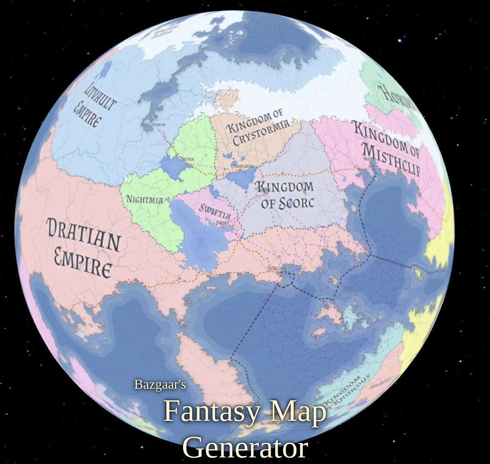
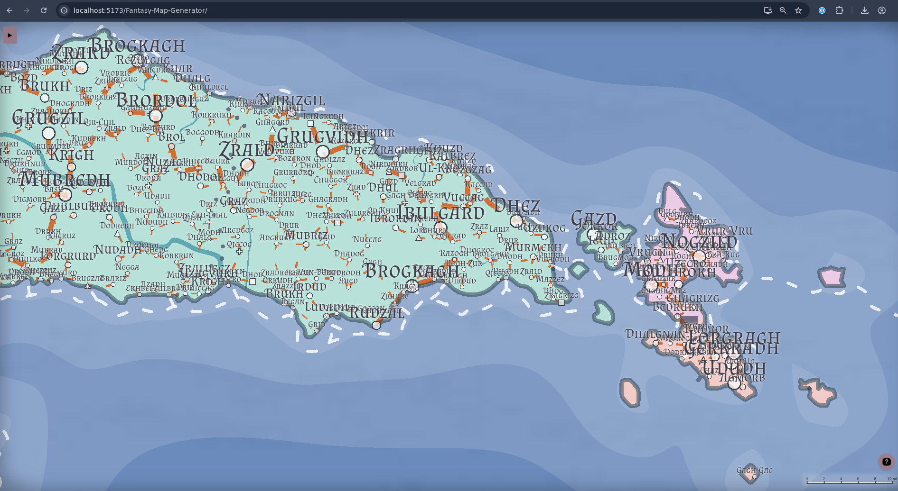
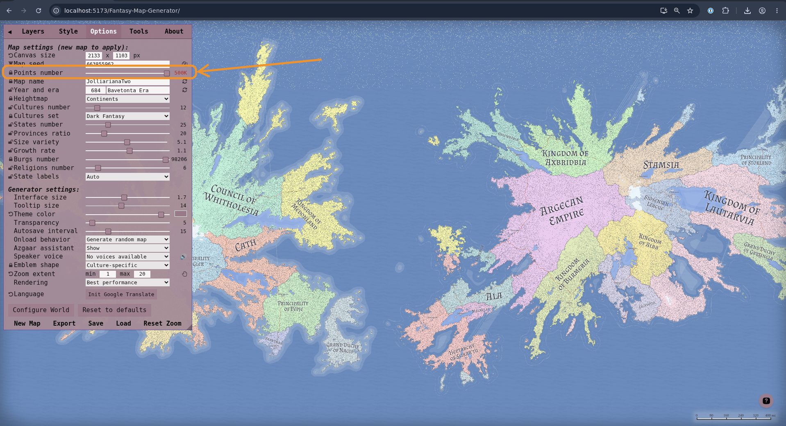
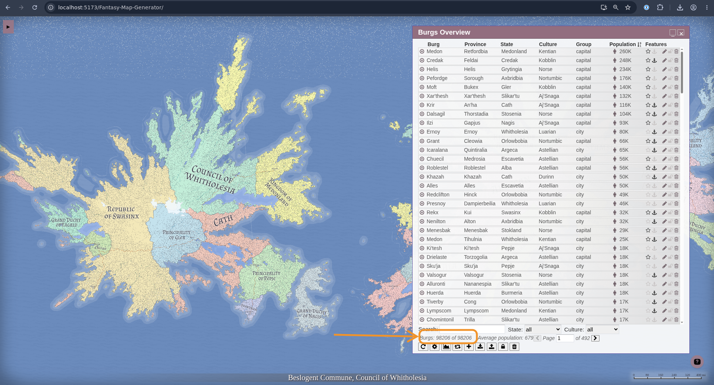
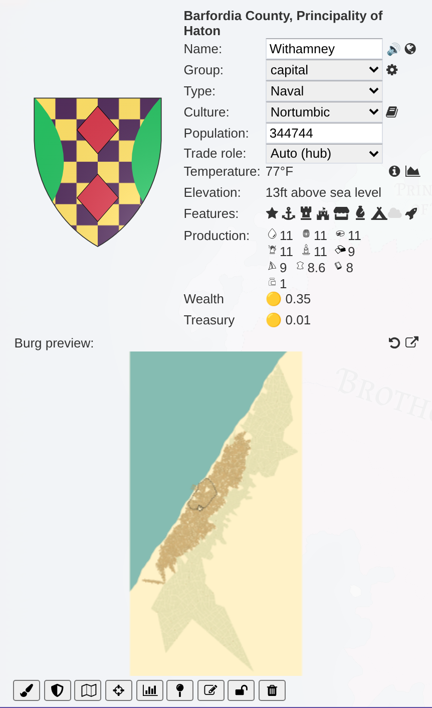
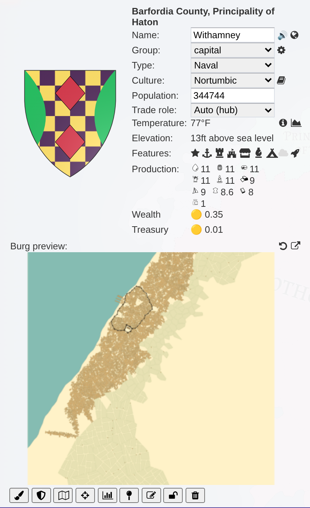
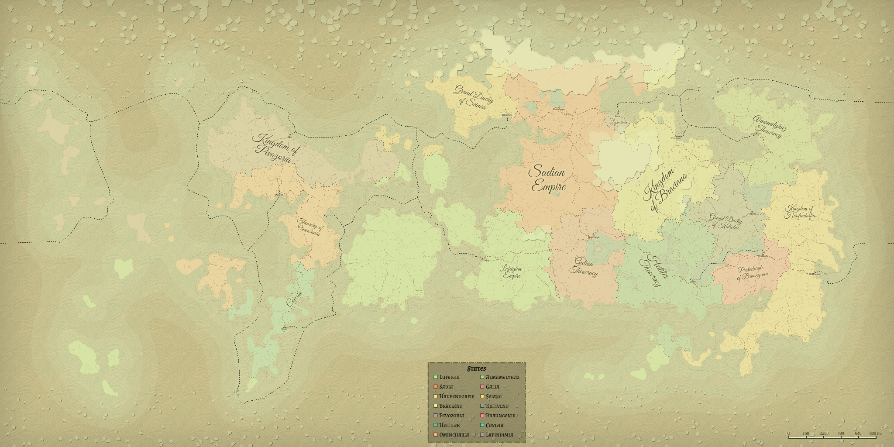
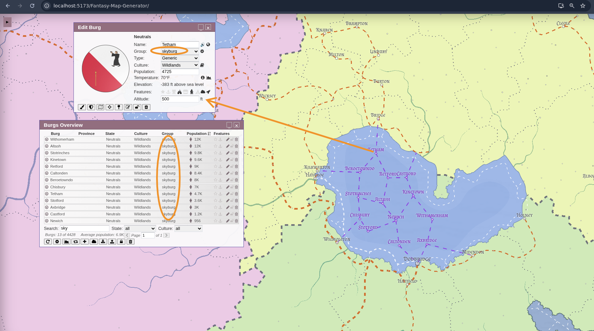

# Fantasy Map Generator (barrulus fork)

A fork of [Azgaar's Fantasy Map Generator](https://github.com/Azgaar/Fantasy-Map-Generator) focused on **larger, denser worlds**: half-million-cell heightmaps, tens of thousands of settlements, a simulated trade network, globe-aware routing, and GPU-rendered settlement layers — while staying compatible with upstream `.map` files.

Upstream docs still apply for the basics: [wiki](https://github.com/Azgaar/Fantasy-Map-Generator/wiki) · [data model](https://github.com/Azgaar/Fantasy-Map-Generator/wiki/Data-model).



## Hierarchical settlements & population

Upstream places capitals and then scatters generic towns by cell suitability. This fork replaces that with a **seven-tier hierarchical placement pass**, each tier filling in around the one above it with its own spacing rules:

**capital → large port → regional centre → market town → large village → small village → hamlet**

- Spacing is culture-aware, so settlement density follows cultural geography rather than a uniform grid.
- Large ports are promoted from strategically placed harbours; regional centres are seeded between primary centres (capitals + large ports) rather than at random.
- Each tier draws population from its own gaussian range (in upstream population units, × population rate for people): capitals 10k–200k, large ports 5k–50k, regional centres and market towns 1k–10k, large villages 200–1k, small villages 50–500, hamlets 10–50.
- Population is then modified by **route connectivity** — well-connected burgs grow, isolated ones stay small.
- Features (citadel, plaza, walls, temple…) and coat-of-arms generation are driven by tier, not just raw population.
- A bug that silently dropped the entire hamlet tier at high target counts is fixed, so dense maps actually get the hamlets they ask for.



## High cell counts (up to 500K)

The heightmap pipeline now produces proper continents at every density the slider exposes:

- The `blobPower`/`linePower` tables capped at 100k cells upstream — anything above silently reused the 10k value and continents collapsed into scattered specks. The tables now extend through 500k.
- Hill/blob shape operations scale their **op counts** with cell count instead of capping BFS depth, so terrain features keep their intended footprint at any density (fractional template syntax like `Hill 0.5` still works).
- New heightmap tooling: a `Power` template step exposing elevation-curve compression, flatten-first elevation distribution for the continents/oldWorld/pangea templates, and a `globeWorld` template that produces ocean-edged worlds suitable for globe rendering.



## Performance at scale

A 500K-cell map with ~100K burgs generates in ~12 seconds. Getting there required fixing a series of hot paths that upstream never hits at default densities:

- **Generation:** culture and state expansion BFS rewritten to kill GC pressure and stale queue work; cost arrays use `Float64Array` (Float32 silently broke priority-queue staleness checks); deep-depression lake filling rewritten as an O(N log N) priority flood; route lookups (`getRoute`/`hasRoad`/`isCrossroad`) moved from linear scans to O(1) `Map` lookups; old pack buffers are released before regeneration to avoid out-of-memory SIGILLs at high densities.
- **Rendering & UI:** burg icons and anchors are culled at low zoom; sky burgs are tiered by population for zoom culling; the map hover tooltip short-circuits when the hovered cell hasn't changed.
- **Editors:** the burgs, states, cultures, religions, rivers, and routes overview dialogs are **paginated** (200 rows per page). Upstream rendered every row at once — with ~20K burgs the dialog froze the UI on open. Sort, filter, and CSV export operate across the full filtered set, not just the visible page.
- **Column visibility:** those same dialogs share a data-driven table built on one column definition, so each has a **show/hide columns** control. Choices persist per editor in `localStorage`, identifying columns are pinned as non-hideable, and mobile starts with the wide columns hidden.



## GPU rendering for burgs

At tens of thousands of settlements the SVG burg layer alone is tens of thousands of DOM nodes, and every pan or zoom repaints them. Burg icons and labels can therefore be rendered on the GPU instead:

- A **renderer-agnostic layer host** interleaves a WebGL canvas between the SVG layers, so the GPU burg layer sits in its correct z-slot rather than on top of the map. Save and export re-unify the split stack, keeping `.map` files loadable by stock upstream.
- Icons are drawn from a packed texture atlas built from the live burg group styles; labels use an **SDF glyph atlas** so they stay crisp at any zoom (fonts and weights are read from the burg groups, so styling still applies).
- Hit-testing (click, hover, relocate) runs against a quadtree instead of the DOM, so editing behaves the same as with SVG burgs.
- Controlled by **Options → WebGL burgs** (`auto` / `on` / `off`); `auto` switches on above ~5000 burgs. Measured on a dense map: pan −55%, zoom −65%, burg DOM nodes 24.5K → 0.

## Multiple burgs per cell & megalopolises

A cell is no longer limited to one settlement. `cells.burg` still records the primary ground burg, with slot helpers for the rest, which lets dense maps place clustered settlements (and sky burgs above ground ones) where upstream would refuse.

Same-cell clusters are derived into a **megalopolis**: below zoom 4 the group renders as a single composite icon and pooled label (population, treasury, production and trade are aggregated onto the anchor), and splits back into its members as you zoom in. Skyburgs are excluded from membership, and composites are gated to the capital tier.

## Burg previews (settlemaker) & preview zoom

The burg editor's map preview is no longer limited to Watabou's generators. Any burg group can pick its preview generator in the **Burg Groups** editor — the Watabou city/village/dwelling generators, or **settlemaker**, which receives far more of the map than a URL of flags can express.



A burg's **context** is extracted from a local cell window around it — approach bearings for each land route entering or passing through, ocean bearing and harbour size, rivers and lake/sea features, elevation with local relief and terrain setting (mountain / hills / plain / valley / plateau / coast), temperature and biome mix, and economy readings (market centre, top goods, treasury band). The projection to settlemaker's input is deliberately narrow — it sends exactly the fields settlemaker declares today, deflate-compressed and base64url-packed into a single `i=` parameter, with a flat query-string fallback when `CompressionStream` is unavailable or the payload exceeds its ~8KB budget. The seed is derived from the burg's own seed key, so a burg's town map is stable across regenerations of everything else.

**Preview zoom.** Scroll to zoom, drag to pan, double-click to zoom in, and a reset button. Zoom is per-source rather than a plain CSS scale, because scaling a cross-origin frame rasterises it and blurs vector content:

- SVG-backed previews (settlemaker) zoom by cheap transform during the gesture, then commit the iframe's *layout* size once it settles — so the embedded page re-renders sharp, without the flicker of committing every wheel tick.
- Canvas-backed previews (Watabou) can't be resized without clearing the canvas, so their layout is locked to a supersampled size at load and zoom stays a pure transform, capped to the supersample budget.

Zoom never carries across burgs. The per-source model was submitted upstream as [#1569](https://github.com/Azgaar/Fantasy-Map-Generator/pull/1569).



## Trade routes

Sea routes are no longer a simple nearest-neighbour graph. Two systems layer together:

**Gravity maritime network.** Every port gets an importance score (population weighted by settlement role). Routes are selected by a gravity model (importance × importance / distance²) in three tiers — trunk lanes between major ports, regional feeders (each major port connects to its top gravity partners within ~300 km), and short coastal hops (≤120 km Urquhart pairs). Gravity selection is bounded to the top ports per navigable ocean component, so it stays tractable with tens of thousands of ports, and pathfinding uses multi-target Dijkstra for the feeder tier.

**Global trade hub network.** On top of the lanes, burgs are assigned trade roles: each state gets one **hub** (the qualifying port nearest its capital) and other large ports become **waystations**. Hubs are linked through a leg graph (same ocean component, within one leg's range) with multi-hop routing and per-leg usage counts, rendered as a dedicated `traderoutes` layer. Legs with no coastal path fall back to routing offshore through deep water. Roles can be overridden per-burg and survive regeneration.



## Globe-aware (seam-wrapping) routes

On full-globe maps (360° longitude), sea and air routes can cross the antimeridian instead of detouring across the whole map: burg pairing uses a toroidal Urquhart graph, sea pathfinding runs on a seam-augmented adjacency graph with wrap-aware A*, and seam-crossing routes are split at the map edge at render time with correctly wrapped lengths.

## Sky burgs & air routes

Burgs can fly. Toggle **Flying** in the burg editor (or _Add sky burg_ from the overview) to lift a settlement above the map at a chosen altitude, and **Sky Port** to mark any ground burg as an air-route hub. Sky ports are connected by an `airroutes` group (Urquhart graph), regenerated automatically whenever the set changes. Map generation can also seed a floating-island archipelago cluster with capital skyports, and sky burgs get their own layer toggle and zoom tiering.



## Other additions

- **States editor:** merge a state down into provinces of a neighbour, and a paint-mode picker to demote a whole state to a province — with demoted provinces coloured and iconed like generated ones.
- **GeoJSON exports:** standalone, bookmarklet-loadable export scripts in `tools/geojson-exports/`.
- **Load from JSON:** Full JSON exports can be loaded back as maps (direct deserialisation, no re-graphing).
- **Map repair tooling:** node/python scripts in `tools/` for `.map` files damaged by line-ending conversion, by stale/desynced feature masks (lakes not rendering), or by an older build's split layer stack.

## Contributed upstream

Generic improvements are submitted back to Azgaar's repo rather than kept fork-only — editor pagination ([#1469](https://github.com/Azgaar/Fantasy-Map-Generator/pull/1469)), data-driven editor table columns ([#1564](https://github.com/Azgaar/Fantasy-Map-Generator/pull/1564)), a Voronoi precision fix ([#1559](https://github.com/Azgaar/Fantasy-Map-Generator/pull/1559)), chunk-preload recovery after deploys ([#1560](https://github.com/Azgaar/Fantasy-Map-Generator/pull/1560)), burg-preview zoom ([#1569](https://github.com/Azgaar/Fantasy-Map-Generator/pull/1569)), and a Full-JSON importer ([#1468](https://github.com/Azgaar/Fantasy-Map-Generator/pull/1468), closed unmerged).

## Installing

Desktop builds for Linux, Windows and macOS are on the
[releases page](https://github.com/barrulus/Fantasy-Map-Generator/releases). Nix
users can skip the AppImage and install from the flake instead:

```sh
nix run github:barrulus/Fantasy-Map-Generator          # run it once
nix profile install github:barrulus/Fantasy-Map-Generator   # install it
```

See [docs/nix.md](docs/nix.md) for NixOS and Home Manager setup, and troubleshooting.

## Development

```sh
nix develop      # dev shell with dependencies (this fork uses a Nix flake, not bare npm install)
npm run dev      # vite dev server
npm run build    # tsc + vite build (output in ../dist/)
npm test         # vitest (src/**/*.test.ts)
npm run lint     # biome (also runs as a pre-commit hook)
```

New systems live as TypeScript modules under `src/`: generators in `src/generators/` (e.g. `burgs-generator`, `routes-generator`, `trade-network-generator`, `air-routes-generator`, `megalopolis`, `burg-context`), editor controllers in `src/controllers/`, IO and integrations in `src/services/` (e.g. `services/previews/settlemaker`), and renderers in `src/renderers/`; the remaining legacy upstream code is vanilla JS in `public/`. The codebase follows upstream's gradual TS migration: world data and styles (state) → generators (model) → editors (controllers) → renderers (view), keeping compatibility with old `.map` files.

## Credits

All the heavy lifting of the original generator is [Azgaar's](https://github.com/Azgaar/Fantasy-Map-Generator) — see the upstream project for the web app, wiki, community links, and ways to support it.
