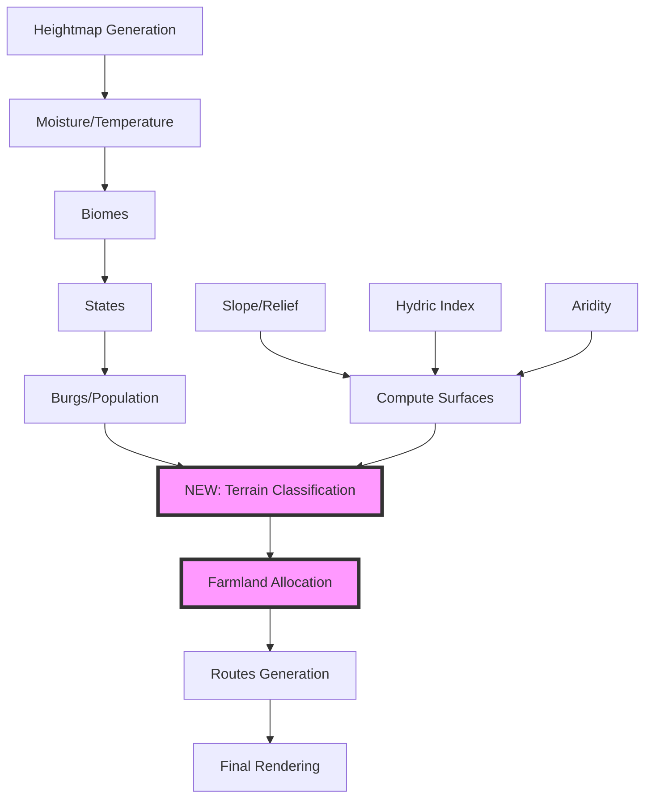
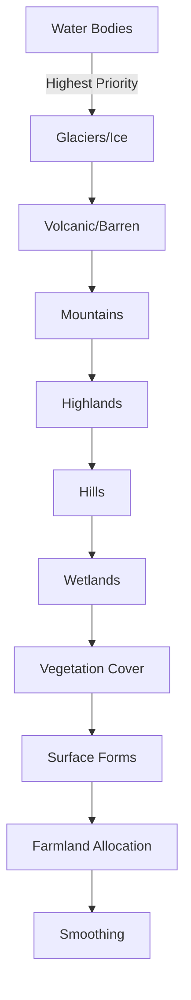

# FMG Full Terrain Layer Implementation Plan

## Complete Terrain System with Medieval Farmlands

### Project Status: 🚧 Implementation Ready

---

## Executive Summary

This plan implements a comprehensive terrain classification system for Fantasy Map Generator (FMG) that includes physical terrain types (mountains, hills, wetlands, etc.) and human land-use patterns (farmlands). The system generates historically-accurate medieval agricultural distribution based on population centers and ensures proper integration with the route generation system.

---

## 1. Architecture Overview



---

## 2. Comprehensive Terrain Taxonomy

### 2.1 Primary Terrain Types

```javascript
const TERRAIN_TYPES = {
  // Water bodies
  OCEAN: "ocean",
  COAST: "coast",
  LAKE: "lake",

  // Orography
  GLACIER: "glacier_ice",
  MOUNTAINS: "mountains",
  HIGHLANDS: "highlands",
  HILLS: "hills",
  PLAINS: "plains",

  // Vegetation/Climate
  DESERT: "desert",
  COLD_DESERT: "cold_desert",
  STEPPE: "steppe",
  GRASSLAND: "grassland",
  SAVANNA: "savanna",
  FOREST_BROADLEAF: "forest_broadleaf",
  FOREST_CONIFER: "forest_conifer",
  RAINFOREST: "rainforest",

  // Wetlands
  WETLAND: "wetland", // with subtypes: swamp, marsh, bog
  DELTA: "delta_floodplain",

  // Surface forms
  DUNES: "dunes",
  BARE_ROCK: "bare_rock",
  VOLCANIC: "volcanic",
  SALT_FLAT: "salt_flat",

  // Human land-use
  CULTIVATED: "cultivated",
};
```

### 2.2 Data Model Extensions

```javascript
// Cell-level data
pack.cells.terrain = new Uint8Array(n); // Primary terrain type
pack.cells.terrainSubtype = new Uint8Array(n); // Secondary classification
pack.cells.terrainBase = new Uint8Array(n); // Pre-farmland terrain (for toggles)
pack.cells.cultivatedIntensity = new Uint8Array(n); // 0-255 farmland intensity
pack.cells.cultivatedBy = new Int16Array(n); // Burg ID (-1 if none)

// Derived surfaces (computed once, cached)
pack.cells.slope = new Float32Array(n);
pack.cells.ruggedness = new Float32Array(n);
pack.cells.hydricIndex = new Float32Array(n);
pack.cells.distToRiver = new Float32Array(n);
pack.cells.distToCoast = new Float32Array(n);
pack.cells.floodplainIndex = new Float32Array(n);
```

---

## 3. Terrain Classification Pipeline

### 3.1 Surface Computation Module

```javascript
// modules/env-surfaces.js
class EnvironmentalSurfaces {
  static computeSlope(cells) {
    // Calculate slope from height differences with neighbors
  }

  static computeRuggedness(cells) {
    // Terrain ruggedness index (TRI)
  }

  static computeHydricIndex(cells) {
    // Wetness potential: moisture + flatness + water proximity
  }

  static computeFloodplain(cells, rivers) {
    // River order + low slope areas
  }

  static computeAridity(cells, moisture, windward) {
    // Rain shadow effects if available
  }
}
```

### 3.2 Classification Order (Priority)



---

## 4. Farmland Allocation System

### 4.1 Demand-Driven Algorithm

```javascript
class FarmlandAllocator {
  calculateBurgDemand(burg, state) {
    const P = burg.population * 1000; // Convert to actual people
    const foodNeedPerCapita = 250; // kg/year
    const buffer = 1.2; // 20% surplus
    const importFactor = burg.port ? 0.3 : 0.1; // Ports import more

    const annualFoodNeed = P * foodNeedPerCapita * buffer * (1 - importFactor);

    // Calculate required area based on local yields
    const avgYield = this.calculateAverageYield(burg.cell);
    const fallowRatio = 0.33; // Three-field system

    return {
      foodNeed: annualFoodNeed,
      requiredArea: (annualFoodNeed / avgYield) * (1 + fallowRatio),
    };
  }

  calculateEffectiveYield(cell) {
    const baseYield = this.biomeYields[cells.biome[cell]] || 500;
    const moistureBonus = 1 + (cells.moisture[cell] - 0.5) * 0.3;
    const slopePenalty = Math.max(0, 1 - cells.slope[cell] / 20);
    const elevationPenalty = Math.max(0, 1 - (cells.h[cell] - 20) / 50);
    const floodplainBonus = cells.floodplainIndex[cell] > 0.5 ? 1.3 : 1.0;

    return (
      baseYield *
      moistureBonus *
      slopePenalty *
      elevationPenalty *
      floodplainBonus
    );
  }
}
```

### 4.2 Multi-Source Region Growing

```javascript
allocateFarmland(burgs, cells) {
  // Priority queue for efficient expansion
  const pq = new PriorityQueue();
  const allocated = new Set();

  // Initialize from each burg
  for (const burg of burgs) {
    const demand = this.calculateBurgDemand(burg);

    pq.push({
      burgId: burg.i,
      cellId: burg.cell,
      distance: 0,
      remainingArea: demand.requiredArea,
      priority: 0
    });
  }

  // Expand until all demands met or no suitable cells
  while (!pq.empty()) {
    const current = pq.pop();

    if (allocated.has(current.cellId)) continue;

    // Check suitability
    const suitability = this.calculateSuitability(current.cellId);
    if (suitability < 0.3) continue;

    // Allocate cell
    cells.terrain[current.cellId] = TERRAIN_TYPES.CULTIVATED;
    cells.cultivatedBy[current.cellId] = current.burgId;
    cells.cultivatedIntensity[current.cellId] = Math.floor(suitability * 255);
    allocated.add(current.cellId);

    // Update remaining area
    const cellArea = this.getCellArea(current.cellId);
    current.remainingArea -= cellArea;

    if (current.remainingArea <= 0) continue;

    // Add neighbors to queue
    for (const neighbor of cells.c[current.cellId]) {
      if (allocated.has(neighbor)) continue;

      const distCost = current.distance + this.getDistanceCost(current.cellId, neighbor);
      const priority = distCost / suitability;

      pq.push({
        burgId: current.burgId,
        cellId: neighbor,
        distance: distCost,
        remainingArea: current.remainingArea,
        priority: priority
      });
    }
  }
}
```

### 4.3 Medieval Settlement Patterns

Based on historical data:

- **Villages (250-300 people)**: 50-100 hectares farmland
- **Market Towns (2,000-10,000)**: 200-500 hectares
- **Cities (10,000+)**: Extensive hinterlands up to 15km radius

```javascript
const SETTLEMENT_FARMLAND = {
  hamlet: { radius: 2, intensity: 0.6 }, // <100 people
  village: { radius: 3, intensity: 0.7 }, // 100-500
  smallTown: { radius: 6, intensity: 0.8 }, // 500-2000
  marketTown: { radius: 10, intensity: 0.85 }, // 2000-10000
  city: { radius: 15, intensity: 0.9 }, // 10000+
};
```

---

## 5. Route Integration

### 5.1 Terrain-Aware Pathfinding

```javascript
// modules/routes-generator.js modifications
function buildRouteCostCache() {
  const RC = new Float32Array(cells.i.length);

  for (let i = 0; i < cells.i.length; i++) {
    let cost = 1.0;

    // Terrain-based costs
    switch (cells.terrain[i]) {
      case TERRAIN_TYPES.CULTIVATED:
        // Prefer paths between fields
        cost *= cells.cultivatedIntensity[i] > 200 ? 1.2 : 0.8;
        break;
      case TERRAIN_TYPES.MOUNTAINS:
        cost *= 3.0;
        break;
      case TERRAIN_TYPES.WETLAND:
        cost *= 2.5;
        break;
      case TERRAIN_TYPES.FOREST_BROADLEAF:
      case TERRAIN_TYPES.FOREST_CONIFER:
        cost *= 1.8;
        break;
      case TERRAIN_TYPES.DUNES:
        cost *= 2.2;
        break;
      case TERRAIN_TYPES.PLAINS:
      case TERRAIN_TYPES.GRASSLAND:
        cost *= 0.9;
        break;
    }

    // Slope modifier
    cost *= 1 + cells.slope[i] / 10;

    RC[i] = cost;
  }

  return RC;
}
```

---

## 6. Rendering System

### 6.1 Layer Structure

```javascript
// Z-order (back to front)
const RENDER_ORDER = [
  "water", // Ocean, lakes
  "wetlands", // Marshes, swamps
  "cultivated", // Farmland patterns
  "vegetation", // Forests, grasslands
  "elevation", // Hills, highlands
  "mountains", // Mountain ranges
  "special", // Ice, dunes, salt flats
];
```

### 6.2 Visual Styles

```javascript
// styles/terrain.json
{
  "cultivated": {
    "patterns": {
      "strip_fields": {
        "pattern": "url(#stripFieldPattern)",
        "fill": "#d4c896",
        "opacity": "intensity * 0.6"
      },
      "open_fields": {
        "pattern": "url(#openFieldPattern)",
        "fill": "#c9bd7f",
        "opacity": "intensity * 0.5"
      }
    }
  },
  "mountains": {
    "fill": "#8b7355",
    "texture": "url(#mountainTexture)",
    "shadow": true
  },
  "wetland": {
    "fill": "#4a6741",
    "pattern": "url(#wetlandStipple)",
    "opacity": 0.7
  }
}
```

### 6.3 Pattern Generation

```javascript
// Generate field patterns based on medieval layouts
function generateFieldPatterns(cell, burgId) {
  const burg = pack.burgs[burgId];
  const distance = getDistance(cell, burg.cell);

  if (distance < 3) {
    // Close to settlement: intensive strip fields
    return "strip_fields";
  } else if (distance < 8) {
    // Middle distance: open field system
    return "open_fields";
  } else {
    // Far: extensive/pastoral
    return "pastures";
  }
}
```

---

## 7. UI Controls

### 7.1 Terrain Panel

```javascript
// modules/ui/terrain-panel.js
const TerrainPanel = {
  elements: {
    // Classification thresholds
    mountainSlope: { min: 15, max: 90, default: 25 },
    hillSlope: { min: 5, max: 25, default: 10 },
    wetlandThreshold: { min: 0.3, max: 0.9, default: 0.6 },

    // Farmland parameters
    farmlandEnabled: { type: "checkbox", default: true },
    yieldMultiplier: { min: 0.5, max: 2.0, default: 1.0 },
    fallowRatio: { min: 0, max: 0.5, default: 0.33 },
    maxFarmSlope: { min: 5, max: 20, default: 12 },
    importFactor: { min: 0, max: 0.5, default: 0.1 },

    // Visual options
    showTerrainTextures: { type: "checkbox", default: true },
    terrainOpacity: { min: 0.3, max: 1.0, default: 0.7 },
    smoothingPasses: { min: 0, max: 3, default: 1 },
  },
};
```

---

## 8. Implementation Timeline

### Phase 1: Core Infrastructure (Week 1)

- [x] Create `modules/terrain-generator.js`
- [x] Create `modules/env-surfaces.js`
- [x] Implement surface calculations (slope, hydric, etc.)
- [x] Add terrain data structures to cells

### Phase 2: Classification System (Week 2)

- [ ] Implement terrain classifier with priority rules
- [ ] Add orography detection (mountains, hills, plains)
- [ ] Implement wetland detection
- [ ] Add vegetation classification

### Phase 3: Farmland System (Week 3)

- [ ] Create `modules/farmland-allocator.js`
- [ ] Implement demand calculation
- [ ] Build multi-source region growing
- [ ] Add conflict resolution

### Phase 4: Route Integration (Week 4)

- [ ] Modify route cost calculations
- [ ] Add terrain-aware pathfinding
- [ ] Test agricultural road networks

### Phase 5: Rendering & UI (Week 5)

- [ ] Create terrain rendering layer
- [ ] Design and implement patterns
- [ ] Build UI controls
- [ ] Add save/load support

### Phase 6: Testing & Optimization (Week 6)

- [ ] Performance optimization
- [ ] Unit tests for classifiers
- [ ] Integration testing
- [ ] Documentation

---

## 9. Performance Optimization

### 9.1 Computational Strategies

```javascript
// Cache expensive calculations
const SurfaceCache = {
  slope: null,
  hydric: null,

  getSlope() {
    if (!this.slope) {
      TIME && console.time("computeSlope");
      this.slope = EnvironmentalSurfaces.computeSlope(pack.cells);
      TIME && console.timeEnd("computeSlope");
    }
    return this.slope;
  },
};

// Use typed arrays for memory efficiency
const TerrainData = {
  allocate(n) {
    return {
      terrain: new Uint8Array(n),
      intensity: new Uint8Array(n),
      owner: new Int16Array(n),
    };
  },
};
```

### 9.2 Web Worker Support

```javascript
// Offload intensive calculations
if (window.Worker) {
  const worker = new Worker("terrain-worker.js");
  worker.postMessage({
    cmd: "classify",
    cells: cells.buffer,
    params: classificationParams,
  });
}
```

---

## 10. Testing Strategy

### 10.1 Unit Tests

```javascript
describe("TerrainClassifier", () => {
  test("identifies mountains correctly", () => {
    const cell = { h: 80, slope: 30 };
    expect(classifier.classify(cell)).toBe(TERRAIN_TYPES.MOUNTAINS);
  });

  test("farmland respects slope limits", () => {
    const cell = { slope: 25 }; // Too steep
    expect(allocator.canBeFarmland(cell)).toBe(false);
  });
});
```

### 10.2 Property-Based Tests

- Cultivated cells slope ≤ maxFarmSlope
- Wetlands within X km of water
- No farmland on glaciers or ocean
- Total farmland area matches burg demands ±10%

### 10.3 Visual Regression

- Snapshot terrain maps for known seeds
- Compare rendered output against references
- Flag significant deviations

---

## 11. Export Formats

### 11.1 GeoJSON Export

```javascript
{
  "type": "FeatureCollection",
  "features": [
    {
      "type": "Feature",
      "properties": {
        "terrain": "cultivated",
        "intensity": 0.8,
        "owner": "Burg_42",
        "yield": 650
      },
      "geometry": { /* polygon */ }
    }
  ]
}
```

### 11.2 Raster Export

- Terrain index as palette PNG
- Intensity as grayscale
- Optional: Multi-band GeoTIFF

---

## 12. Documentation Requirements

### User Guide

- Terrain types explanation
- Farmland generation mechanics
- UI controls reference
- Performance tips

### Developer Documentation

- API reference
- Algorithm explanations
- Extension points
- Data format specifications

---

## 13. Future Enhancements

### Near-term

- Seasonal variations (winter/summer fields)
- Irrigation systems
- Terraced farming on slopes
- Orchards and vineyards

### Long-term

- Economic simulation
- Population feedback loops
- Climate change impacts
- Historical progression (enclosure, mechanization)

---

## Conclusion

This integrated plan combines:

- **Comprehensive terrain classification** covering all surface types
- **Historically-accurate farmland generation** based on medieval patterns
- **Proper pipeline integration** with terrain before routes
- **Performance-optimized implementation** using typed arrays and caching
- **Extensible architecture** for future enhancements

**Estimated Development Time:** 6 weeks
**Complexity:** High
**Impact:** Major improvement to map realism and gameplay depth

The system provides a complete terrain layer that enhances both visual appeal and strategic gameplay while maintaining historical accuracy and computational efficiency.
