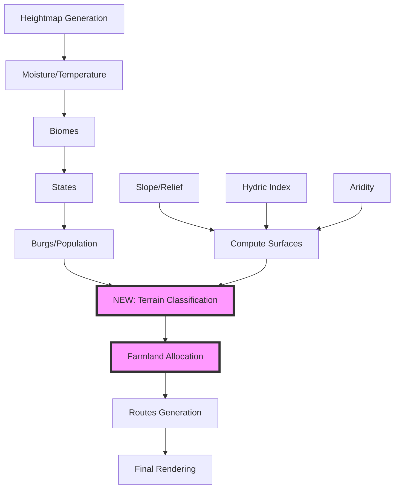
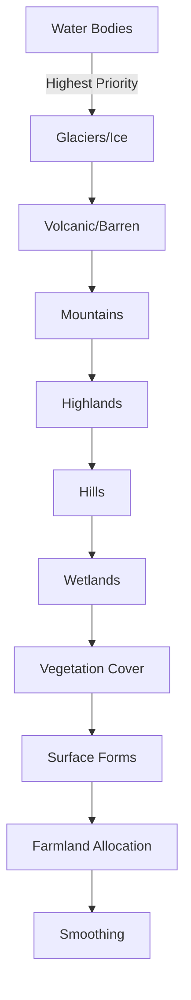

# Terrain — Merged Specs and Tasks

This file consolidates all `terrain_*` markdown documents into a single reference.

Included sources (alphabetical):
- terrain_claude.md
- terrain_claude_tasks.md
- terrain_codex.md
- terrain_codex_tasks.md

---

## Source: terrain_codex.md

# Terrain

This is a **single, end-to-end plan** for a **full Terrain layer** in FMG that _adds_ **Cultivated (farmland)** while also classifying **all other terrains** in a coherent pass. Hand this to an agent as the implementation spec.

---

# Full Terrain Layer (with Farmland) — Implementation Plan

## 0) Goal & Placement in Pipeline

Produce a **terrain** layer (categorical + intensities) that captures the physical surface (mountains, hills, plains, wetlands, dunes, glaciers, etc.) **and** human land-use (**cultivated**) driven by burg populations.

**Pipeline (updated):**
`heightmap → moisture/temperature → biomes → states → burgs → terrain (this module) → routes`

_(Terrain runs after burgs so farmland can be allocated, and before routes so roads can respond to terrain & fields.)_

---

## 1) Terrain Taxonomy (top-level `terrain` + optional `subtype`)

**Land/Water split**

- `ocean` (deep), `coast` (littoral), `lake`

**Orography**

- `glacier_ice` (snowline & polar),
- `mountains` (elevation + slope),
- `highlands` (plateau),
- `hills` (moderate slope/relief),
- `plains` (low slope)

**Aridity / Vegetation**

- `desert` (hot/arid), `cold_desert` (arid + cold),
- `steppe` (semi-arid grass),
- `grassland` (mesic),
- `savanna` (seasonal),
- `forest_broadleaf`, `forest_conifer`, `rainforest`

**Wetlands / Special**

- `swamp`, `marsh`, `bog/fen` (collapse to `wetland` with `subtype`),
- `delta_floodplain`

**Surface Form**

- `dunes` (aeolian), `bare_rock/scree`, `volcanic/barren`, `salt_flat`

**Human Land-use**

- `cultivated` (farmland), with intensity and burg attribution

> Keep **biome** as a separate concept. Terrain is **physical + land-use**; biome remains **ecological**. They inform each other but aren’t identical.

---

## 2) Inputs (existing + derived)

- **Cells**: elevation/height, water, temperature, moisture, biome, rivers/lakes, coastline
- **Burgs**: location, population, port flag, state/culture
- **Derived layers (compute once):**

  - `slope`, `ruggedness`, `relative_relief` (from heightmap)
  - `dist_to_river`, `dist_to_coast`, `floodplain index` (river order + low slope)
  - `rain_shadow / aridity index` (windward/leeward if available; else moisture proxy)
  - `permafrost index` (temperature + altitude)
  - `sandiness proxy` (from biome + coastal/leeward dunes)
  - `hydric index` (moisture + flatness + river/lake adjacency)

---

## 3) Classification Strategy (order matters)

The classifier runs **once** and writes `cell.terrain`, `cell.terrainSubtype`, and optional intensities.

**A. Hard overrides (highest precedence)**

1. `ocean`, `lake` by water mask
2. `glacier_ice` by temperature/permafrost & elevation thresholds
3. `volcanic/barren` if FMG marks volcanic peaks (else from slope + bare biome)

**B. Orography**
4\) `mountains` (elev ≥ H1 _or_ slope ≥ S1 _and_ relative_relief ≥ R1)
5\) `highlands` (elev ≥ H0 _or_ relief ≥ R0) not already mountains
6\) `hills` (slope between S0..S1 or relief R0..R1)
7\) remaining default to `plains`

**C. Hydrology & Wetness**
8\) `wetland` where hydric index ≥ W1 (subtype `swamp/marsh/bog` via pH/flow proxy)
9\) `delta_floodplain` = (floodplain + coastal/river mouth + low slope)

**D. Aridity / Vegetation refinement (only for cells not set above)**
10\) Assign **cover** based on temperature & (moisture − aridity), with latitude/elevation lapse rate:

- `desert` / `cold_desert`, `steppe`, `grassland`, `savanna`, `forest_broadleaf`, `forest_conifer`, `rainforest`
- Store as `terrain` where orography is `plains/highlands`; if orography is `hills/mountains`, keep the orography in `terrain` and write vegetation to `terrainSubtype` (e.g., `mountains + conifer`).

**E. Surface forms**
11\) `dunes` if sandiness high AND arid AND low relief (override vegetation on those cells)
12\) `salt_flat` if arid AND endorheic low spots (near playas)

**F. Human land-use (farmland)**
13\) Run **Farmland Allocation** (Section 4) and set cells to `cultivated` (with intensity).
\- Farmland **can override** steppe/grassland/plains/savanna/forest edges and floodplains; **cannot override** glaciers, open water, steep mountains, dunes, salt, deep wetlands.
\- Keep original classification in `terrainBase` to allow toggling back.

**G. Smoothing/Regionalization**
14\) Majority filter (1–2 passes) + contiguity preference to reduce speckle
15\) Merge contiguous regions to polygons (optional) for labels

---

## 4) Farmland Allocation (demand-driven by burgs)

**Per-burg demand**

```
annual_food_need = P_b * food_need_per_capita * (1 + buffer) * (1 - import_factor)
effective_yield(cell) = base_yield(biome) * moisture_bonus * (1 - slope_penalty) * (1 - elevation_penalty) * floodplain_bonus
required_area_b = annual_food_need / avg_local_yield * (1 + fallow_ratio)
```

- `import_factor`: higher for ports & major river nodes
- Seed defaults from your medieval density doc; expose all as options

**Suitability (FSS)**

- From `effective_yield` normalized 0–1; +proximity to rivers/coasts; −penalty for wetlands (unless drained option enabled); −penalty for >S_farm slope

**Allocator**

- Multi-source region grow from each burg using a **priority queue** keyed by `(dist_cost, -FSS)` until `required_area_b` met
- **Distance decay** to encourage tight belts around towns and along valleys
- **Conflicts** resolved by higher pressure = `remaining_area_b / dist_cost`
- Write:

  - `terrain="cultivated"`,
  - `cultivatedIntensity` (0–1),
  - `cultivatedBy` (burg id)
  - `farmlandArea` aggregated per burg/state

---

## 5) Data Model (additions)

**Cells**

- `terrain` (enum above)
- `terrainSubtype` (optional: vegetation on hills/mountains; wetland type; etc.)
- `terrainBase` (pre-farmland category for toggles)
- `cultivatedIntensity` (0–1), `cultivatedBy` (int | -1)
- `forestDensity` (0–1) if you want canopy-aware styling
- `wetness` (0–1) retained for effects

**Burgs / States**

- `burgs.farmlandArea` (ha), `importFactor` resolved
- `states.cultivatedArea`, `cultivatedPerCapita`

**Exports**

- Cell GeoJSON with properties above
- Optional dissolved polygons per terrain class
- Palette PNG (terrain index) for fast rasterized overlays

---

## 6) Rendering (Canvas + Leaflet/QGIS)

- **Z-order**: water → wetlands/deltas → cultivated → grass/savanna/forest → hills/highlands → mountains → ice/dunes/salt
- **Textures**:

  - cultivated: patchwork hatching/noise aligned to aspect
  - dunes: gentle ridge lines; wetlands: stipple/wavelet texture; mountains: shading already present

- **Intensity mapping**:

  - cultivatedIntensity → saturation/brightness
  - forestDensity → tree symbol density (optional)

- **Layer toggles**:

  - “Terrain (full)”, plus subtoggles for “Show cultivated overlay”, “Show wetlands/deltas”, “Show vegetation on elevation”

---

## 7) Effects on Other Systems

- **Routes**: prefer cultivated, plains, valleys; penalize wetlands/dunes/steep slopes; avoid splitting large cultivated polygons (small extra cost to encourage skirt roads)
- **Population feedback (optional)**: modest positive feedback from cultivated area into burg population cap on re-gen
- **Labels**: auto-name major polygons (“The Wheatlands”, “Red Dunes”, “Black Bog”) using state/culture dictionaries

---

## 8) UI & Tuning Options

- Sliders: slope thresholds (mountain/hill), snowline/elevation lapse, aridity cutpoints
- Farmland: per-biome yields, fallow ratio, buffer %, max farm slope, river/coast bonus, port import factor, max radius (km)
- Wetlands: aggressiveness, drainage option
- Dunes & salt flats: enable/disable + sensitivity
- Smoothing rounds & polygon dissolve tolerance

---

## 9) Implementation (FMG JS) — Files & Hooks

- `modules/terrain-generator.js` (new): orchestrates steps 2–3–4–5 above
- `modules/farmland-allocator.js` (new): the demand/suitability multi-source grower
- `modules/env-surfaces.js` (new or extend): slope, relief, hydric, floodplain, aridity helpers
- `layers/render-terrain.js` (new): styling & canvas draws (and palette export)
- `ui/terrain-panel.js` (new): options & toggles
- **Hook** in main flow:

  ```js
  BurgsAndStates.generate();
  Terrain.generate({
    cells,
    burgs,
    rivers,
    lakes,
    biomesData,
    options: Terrain.defaults(),
  });
  Routes.generate(); // terrain-aware
  ```

- **Save/Load**: include new fields; fall back gracefully if absent

---

## 10) py-fmg / PostGIS Variant (optional path)

- Load cells/burgs; compute surfaces with SQL (`ST_Slope`, `ST_TPI` analogs via rasters, or Python)
- Build terrain via CASE logic; allocate farmland with a PQ grower (distance from burg along low-cost graph; FSS as weight)
- Write attributes back; dissolve polygons with `ST_Union`; export GeoJSON/MBTiles

---

## 11) Testing & Validation

- **Unit**: threshold functions (mountain/hill), suitability, allocator conflict resolution
- **Property tests**:

  - cultivated cells slope ≤ S_farm (almost always)
  - wetlands within X km of water and low slope
  - dunes appear only in arid + sandy zones

- **Regression**: snapshot terrain index rasters for known seeds
- **Sanity dashboards**:

  - histogram of terrain by biome; cultivated area per burg vs population; mean slope of cultivated cells; share of roads by terrain

---

## 12) Performance Notes

- Precompute and cache all surfaces; use typed arrays
- Farmland grower: cap search radius using heuristic
  `r_max ≈ sqrt(required_area / mean_FSS_density)`
- Parallelize per-burg expansions in tiles where safe (web worker)

---

## 13) Deliverables

- New modules (terrain + farmland + surfaces + renderer + UI)
- Updated schema + save/load migration
- Palette PNG + style guide
- Exporters (GeoJSON, optional raster)
- README: thresholds, tunables, and example configs
- Example seeds & screenshots (including cultivated overlay)

---

## Source: terrain_codex_tasks.md

# Terrain Codex Implementation — Analysis and Task Plan

This document translates `terrain_codex.md` into a concrete, repo-aligned plan to implement a full Terrain layer (including Cultivated/Farmland) in Fantasy Map Generator (FMG). It covers current-state analysis, architecture, data model updates, integration points, and a phased task plan with clear file targets and deliverables.

---

## Current State Analysis (Repo)

- Layers and pipeline:
  - `main.js:756–793` builds the generation pipeline without a terrain module yet; relevant steps include `Rivers.generate()`, `Biomes.define()`, `Cultures.generate()`, `BurgsAndStates.generate()`, `Routes.generate()`. Proposed insertion point: after burgs, before routes.
  - Existing SVG groups include `#biomes` and `#terrain`. Note: `#terrain` is used for relief icons, not for categorical land-cover.
    - Relief icons renderer: `modules/renderers/draw-relief-icons.js`
    - Relief layer toggles: `modules/ui/layers.js:752–767` (`toggleRelief`, `drawReliefIcons`)

- Rendering patterns to reuse:
  - Biomes are rendered by isolines grouped by ID → fill paths: `modules/ui/layers.js:271–286`. We can replicate this approach for terrain categories.

- Data structures and save/load:
  - `pack.cells` arrays include `biome`, `burg`, `state`, `routes`, etc. No terrain-specific arrays yet.
  - Save: `modules/io/save.js:102–158` composes a `.map` payload from `pack` and `grid`. New arrays must be serialized here.
  - Load: `modules/io/load.js:382–459` rehydrates `pack` fields and toggles layers. New arrays must be parsed and applied here.

- Routes integration baseline:
  - Cost cache in `modules/routes-generator.js:100–138` uses height, habitability, burg factor, water type. It does not yet consider terrain categories or farmland.
  - Cost evaluator in `modules/routes-generator.js:994–1053` is where new terrain-based costs/penalties can be applied per route tier.

- Surfaces availability:
  - Heights exist (`pack.cells.h`) but there’s no precomputed `slope`, `relief`, `hydric`, etc. We will add a new helper module to compute and cache these.

- UI structure:
  - Layer toggles live in `modules/ui/layers.js`. We should add a dedicated toggle and draw function for the full Terrain view, separate from relief icons.

---

## Proposed Architecture (Repo-Aligned)

- Classification and orchestration:
  - `modules/terrain-generator.js` (new): drives the end-to-end terrain classification, writes `pack.cells` arrays, and calls farmland allocator.

- Environmental surfaces:
  - `modules/env-surfaces.js` (new): computes `slope`, `relative_relief`, `ruggedness`, `hydric index`, `floodplain index`, `aridity index`, and optional `permafrost`, `sandiness` proxies. Uses typed arrays.

- Farmland allocation:
  - `modules/farmland-allocator.js` (new): demand-driven multi-source grower keyed by `(distance_cost, -FSS)` satisfying per-burg food/area requirements.

- Rendering:
  - `modules/renderers/render-terrain.js` (new): renders a categorical Terrain overlay similar to biomes via isolines; produces optional palette PNG export.
  - New SVG group `#landcover` for the categorical Terrain layer to avoid colliding with existing `#terrain` (relief icons). Insert near other groups in `main.js`.

- UI:
  - `modules/ui/terrain-panel.js` (new): adds terrain options (threshold sliders, farmland tuning, smoothing rounds), and registers a new layer toggle `toggleTerrainFull` + drawer `drawTerrain` inside `modules/ui/layers.js`.

- Data model additions on `pack.cells`:
  - `terrain` (Uint16/Uint8 enum), `terrainSubtype` (Uint16/Uint8 enum or packed int), `terrainBase` (pre-farmland),
    `cultivatedIntensity` (Float32Array 0–1), `cultivatedBy` (Uint16 burg id or 0), optional `forestDensity` (Float32Array 0–1), `wetness` (Float32Array 0–1).
  - On `pack.burgs` / `pack.states`: `farmlandArea`, `cultivatedArea`, `cultivatedPerCapita` as numbers.
  - Save/Load: extend `modules/io/save.js` and `modules/io/load.js` with backward-compatible slots.

- Routing:
  - Extend `modules/routes-generator.js` cost cache and evaluators to account for new terrain and farmland (cheaper across cultivated/plains/valley cells; higher penalties for wetlands/dunes/steep mountains; respect farmland polygon integrity with small split penalty).

---

## Terrain Taxonomy Mapping (From Codex)

- Land/Water: `ocean`, `coast`, `lake` (existing water masks)
- Orography: `glacier_ice`, `mountains`, `highlands`, `hills`, `plains`
- Aridity/Vegetation: `desert`, `cold_desert`, `steppe`, `grassland`, `savanna`, `forest_broadleaf`, `forest_conifer`, `rainforest`
- Wetlands/Special: `wetland` with subtype `swamp|marsh|bog`, `delta_floodplain`
- Surface forms: `dunes`, `bare_rock`, `volcanic`, `salt_flat`
- Human land-use: `cultivated` with intensity and burg attribution

Notes:
- Keep biome/ecology separate; write vegetation to `terrainSubtype` when orography is dominant (e.g., `mountains + conifer`).
- `terrainBase` stores pre-farmland class for toggles.

---

## Integration Points (Concrete Files)

- Add generation step in pipeline:
  - After `BurgsAndStates.generate()` and before `Routes.generate()` invoke `Terrain.generate()`.

---

## Minimal Viable Slice (MVS)

- Compute slope/relief/hydric surfaces.
- Classify orography + wetlands + vegetation (as subtype on relief) + dunes/salt.
- No farmland in MVS; render categorical Terrain in `#landcover` with isolines.
- Save/load `terrain` only; routes unchanged.
- Follow-up slice: add farmland allocation + routes integration.

---

## Estimation (High-Level)

- Phase 0–2: 1.5–2.5 days (surfaces + core classifier + rendering)
- Phase 3: 1–2 days (allocator, tuning, aggregates)
- Phase 4–7: 1–2 days (persistence + routes + UI polish)
- QA/docs: 0.5–1 day

These are ballparks; complexity depends on tuning and performance work.


---

## Source: terrain_claude.md

# FMG Full Terrain Layer Implementation Plan

## Complete Terrain System with Medieval Farmlands

### Project Status: 🚧 Implementation Ready

---

## Executive Summary

This plan implements a comprehensive terrain classification system for Fantasy Map Generator (FMG) that includes physical terrain types (mountains, hills, wetlands, etc.) and human land-use patterns (farmlands). The system generates historically-accurate medieval agricultural distribution based on population centers and ensures proper integration with the route generation system.

---

## 1. Architecture Overview



---

## 2. Comprehensive Terrain Taxonomy

### 2.1 Primary Terrain Types

```javascript
const TERRAIN_TYPES = {
  // Water bodies
  OCEAN: "ocean",
  COAST: "coast",
  LAKE: "lake",

  // Orography
  GLACIER: "glacier_ice",
  MOUNTAINS: "mountains",
  HIGHLANDS: "highlands",
  HILLS: "hills",
  PLAINS: "plains",

  // Vegetation/Climate
  DESERT: "desert",
  COLD_DESERT: "cold_desert",
  STEPPE: "steppe",
  GRASSLAND: "grassland",
  SAVANNA: "savanna",
  FOREST_BROADLEAF: "forest_broadleaf",
  FOREST_CONIFER: "forest_conifer",
  RAINFOREST: "rainforest",

  // Wetlands
  WETLAND: "wetland", // with subtypes: swamp, marsh, bog
  DELTA: "delta_floodplain",

  // Surface forms
  DUNES: "dunes",
  BARE_ROCK: "bare_rock",
  VOLCANIC: "volcanic",
  SALT_FLAT: "salt_flat",

  // Human land-use
  CULTIVATED: "cultivated",
};
```

### 2.2 Data Model Extensions

```javascript
// Cell-level data
pack.cells.terrain = new Uint8Array(n); // Primary terrain type
pack.cells.terrainSubtype = new Uint8Array(n); // Secondary classification
pack.cells.terrainBase = new Uint8Array(n); // Pre-farmland terrain (for toggles)
pack.cells.cultivatedIntensity = new Uint8Array(n); // 0-255 farmland intensity
pack.cells.cultivatedBy = new Int16Array(n); // Burg ID (-1 if none)

// Derived surfaces (computed once, cached)
pack.cells.slope = new Float32Array(n);
pack.cells.ruggedness = new Float32Array(n);
pack.cells.hydricIndex = new Float32Array(n);
pack.cells.distToRiver = new Float32Array(n);
pack.cells.distToCoast = new Float32Array(n);
pack.cells.floodplainIndex = new Float32Array(n);
```

---

## 3. Terrain Classification Pipeline

### 3.1 Surface Computation Module

```javascript
// modules/env-surfaces.js
class EnvironmentalSurfaces {
  static computeSlope(cells) {
    // Calculate slope from height differences with neighbors
  }

  static computeRuggedness(cells) {
    // Terrain ruggedness index (TRI)
  }

  static computeHydricIndex(cells) {
    // Wetness potential: moisture + flatness + water proximity
  }

  static computeFloodplain(cells, rivers) {
    // River order + low slope areas
  }

  static computeAridity(cells, moisture, windward) {
    // Rain shadow effects if available
  }
}
```

### 3.2 Classification Order (Priority)



---

## 4. Farmland Allocation System

### 4.1 Demand-Driven Algorithm

```javascript
class FarmlandAllocator {
  calculateBurgDemand(burg, state) {
    const P = burg.population * 1000; // Convert to actual people
    const foodNeedPerCapita = 250; // kg/year
    const buffer = 1.2; // 20% surplus
    const importFactor = burg.port ? 0.3 : 0.1; // Ports import more

    const annualFoodNeed = P * foodNeedPerCapita * buffer * (1 - importFactor);

    // Calculate required area based on local yields
    const avgYield = this.calculateAverageYield(burg.cell);
    const fallowRatio = 0.33; // Three-field system

    return {
      foodNeed: annualFoodNeed,
      requiredArea: (annualFoodNeed / avgYield) * (1 + fallowRatio),
    };
  }

  calculateEffectiveYield(cell) {
    const baseYield = this.biomeYields[cells.biome[cell]] || 500;
    const moistureBonus = 1 + (cells.moisture[cell] - 0.5) * 0.3;
    const slopePenalty = Math.max(0, 1 - cells.slope[cell] / 20);
    const elevationPenalty = Math.max(0, 1 - (cells.h[cell] - 20) / 50);
    const floodplainBonus = cells.floodplainIndex[cell] > 0.5 ? 1.3 : 1.0;

    return (
      baseYield *
      moistureBonus *
      slopePenalty *
      elevationPenalty *
      floodplainBonus
    );
  }
}
```

### 4.2 Multi-Source Region Growing

```javascript
allocateFarmland(burgs, cells) {
  // Priority queue for efficient expansion
  const pq = new PriorityQueue();
  const allocated = new Set();

  // Initialize from each burg
  for (const burg of burgs) {
    const demand = this.calculateBurgDemand(burg);

    pq.push({
      burgId: burg.i,
      cellId: burg.cell,
      distance: 0,
      remainingArea: demand.requiredArea,
      priority: 0
    });
  }

  // Expand until all demands met or no suitable cells
  while (!pq.empty()) {
    const current = pq.pop();

    if (allocated.has(current.cellId)) continue;

    // Check suitability
    const suitability = this.calculateSuitability(current.cellId);
    if (suitability < 0.3) continue;

    // Allocate cell
    cells.terrain[current.cellId] = TERRAIN_TYPES.CULTIVATED;
    cells.cultivatedBy[current.cellId] = current.burgId;
    cells.cultivatedIntensity[current.cellId] = Math.floor(suitability * 255);
    allocated.add(current.cellId);

    // Update remaining area
    const cellArea = this.getCellArea(current.cellId);
    current.remainingArea -= cellArea;

    if (current.remainingArea <= 0) continue;

    // Add neighbors to queue
    for (const neighbor of cells.c[current.cellId]) {
      if (allocated.has(neighbor)) continue;

      const distCost = current.distance + this.getDistanceCost(current.cellId, neighbor);
      const priority = distCost / suitability;

      pq.push({
        burgId: current.burgId,
        cellId: neighbor,
        distance: distCost,
        remainingArea: current.remainingArea,
        priority: priority
      });
    }
  }
}
```

### 4.3 Medieval Settlement Patterns

Based on historical data:

- **Villages (250-300 people)**: 50-100 hectares farmland
- **Market Towns (2,000-10,000)**: 200-500 hectares
- **Cities (10,000+)**: Extensive hinterlands up to 15km radius

```javascript
const SETTLEMENT_FARMLAND = {
  hamlet: { radius: 2, intensity: 0.6 }, // <100 people
  village: { radius: 3, intensity: 0.7 }, // 100-500
  smallTown: { radius: 6, intensity: 0.8 }, // 500-2000
  marketTown: { radius: 10, intensity: 0.85 }, // 2000-10000
  city: { radius: 15, intensity: 0.9 }, // 10000+
};
```

---

## 5. Route Integration

### 5.1 Terrain-Aware Pathfinding

```javascript
// modules/routes-generator.js modifications
function buildRouteCostCache() {
  const RC = new Float32Array(cells.i.length);

  for (let i = 0; i < cells.i.length; i++) {
    let cost = 1.0;

    // Terrain-based costs
    switch (cells.terrain[i]) {
      case TERRAIN_TYPES.CULTIVATED:
        // Prefer paths between fields
        cost *= cells.cultivatedIntensity[i] > 200 ? 1.2 : 0.8;
        break;
      case TERRAIN_TYPES.MOUNTAINS:
        cost *= 3.0;
        break;
      case TERRAIN_TYPES.WETLAND:
        cost *= 2.5;
        break;
      case TERRAIN_TYPES.FOREST_BROADLEAF:
      case TERRAIN_TYPES.FOREST_CONIFER:
        cost *= 1.8;
        break;
      case TERRAIN_TYPES.DUNES:
        cost *= 2.2;
        break;
      case TERRAIN_TYPES.PLAINS:
      case TERRAIN_TYPES.GRASSLAND:
        cost *= 0.9;
        break;
    }

    // Slope modifier
    cost *= 1 + cells.slope[i] / 10;

    RC[i] = cost;
  }

  return RC;
}
```

---

## 6. Rendering System

### 6.1 Layer Structure

```javascript
// Z-order (back to front)
const RENDER_ORDER = [
  "water", // Ocean, lakes
  "wetlands", // Marshes, swamps
  "cultivated", // Farmland patterns
  "vegetation", // Forests, grasslands
  "elevation", // Hills, highlands
  "mountains", // Mountain ranges
  "special", // Ice, dunes, salt flats
];
```

### 6.2 Visual Styles

```javascript
// styles/terrain.json
{
  "cultivated": {
    "patterns": {
      "strip_fields": {
        "pattern": "url(#stripFieldPattern)",
        "fill": "#d4c896",
        "opacity": "intensity * 0.6"
      },
      "open_fields": {
        "pattern": "url(#openFieldPattern)",
        "fill": "#c9bd7f",
        "opacity": "intensity * 0.5"
      }
    }
  },
  "mountains": {
    "fill": "#8b7355",
    "texture": "url(#mountainTexture)",
    "shadow": true
  },
  "wetland": {
    "fill": "#4a6741",
    "pattern": "url(#wetlandStipple)",
    "opacity": 0.7
  }
}
```

### 6.3 Pattern Generation

```javascript
// Generate field patterns based on medieval layouts
function generateFieldPatterns(cell, burgId) {
  const burg = pack.burgs[burgId];
  const distance = getDistance(cell, burg.cell);

  if (distance < 3) {
    // Close to settlement: intensive strip fields
    return "strip_fields";
  } else if (distance < 8) {
    // Middle distance: open field system
    return "open_fields";
  } else {
    // Far: extensive/pastoral
    return "pastures";
  }
}
```

---

## 7. UI Controls

### 7.1 Terrain Panel

```javascript
// modules/ui/terrain-panel.js
const TerrainPanel = {
  elements: {
    // Classification thresholds
    mountainSlope: { min: 15, max: 90, default: 25 },
    hillSlope: { min: 5, max: 25, default: 10 },
    wetlandThreshold: { min: 0.3, max: 0.9, default: 0.6 },

    // Farmland parameters
    farmlandEnabled: { type: "checkbox", default: true },
    yieldMultiplier: { min: 0.5, max: 2.0, default: 1.0 },
    fallowRatio: { min: 0, max: 0.5, default: 0.33 },
    maxFarmSlope: { min: 5, max: 20, default: 12 },
    importFactor: { min: 0, max: 0.5, default: 0.1 },

    // Visual options
    showTerrainTextures: { type: "checkbox", default: true },
    terrainOpacity: { min: 0.3, max: 1.0, default: 0.7 },
    smoothingPasses: { min: 0, max: 3, default: 1 },
  },
};
```

---

## 8. Implementation Timeline

### Phase 1: Core Infrastructure (Week 1)

- [x] Create `modules/terrain-generator.js`
- [x] Create `modules/env-surfaces.js`
- [x] Implement surface calculations (slope, hydric, etc.)
- [x] Add terrain data structures to cells

### Phase 2: Classification System (Week 2)

- [ ] Implement terrain classifier with priority rules
- [ ] Add orography detection (mountains, hills, plains)
- [ ] Implement wetland detection
- [ ] Add vegetation classification

### Phase 3: Farmland System (Week 3)

- [ ] Create `modules/farmland-allocator.js`
- [ ] Implement demand calculation
- [ ] Build multi-source region growing
- [ ] Add conflict resolution

### Phase 4: Route Integration (Week 4)

- [ ] Modify route cost calculations
- [ ] Add terrain-aware pathfinding
- [ ] Test agricultural road networks

### Phase 5: Rendering & UI (Week 5)

- [ ] Create terrain rendering layer
- [ ] Design and implement patterns
- [ ] Build UI controls
- [ ] Add save/load support

### Phase 6: Testing & Optimization (Week 6)

- [ ] Performance optimization
- [ ] Unit tests for classifiers
- [ ] Integration testing
- [ ] Documentation

---

## 9. Performance Optimization

### 9.1 Computational Strategies

```javascript
// Cache expensive calculations
const SurfaceCache = {
  slope: null,
  hydric: null,

  getSlope() {
    if (!this.slope) {
      TIME && console.time("computeSlope");
      this.slope = EnvironmentalSurfaces.computeSlope(pack.cells);
      TIME && console.timeEnd("computeSlope");
    }
    return this.slope;
  },
};

// Use typed arrays for memory efficiency
const TerrainData = {
  allocate(n) {
    return {
      terrain: new Uint8Array(n),
      intensity: new Uint8Array(n),
      owner: new Int16Array(n),
    };
  },
};
```

### 9.2 Web Worker Support

```javascript
// Offload intensive calculations
if (window.Worker) {
  const worker = new Worker("terrain-worker.js");
  worker.postMessage({
    cmd: "classify",
    cells: cells.buffer,
    params: classificationParams,
  });
}
```

---

## 10. Testing Strategy

### 10.1 Unit Tests

```javascript
describe("TerrainClassifier", () => {
  test("identifies mountains correctly", () => {
    const cell = { h: 80, slope: 30 };
    expect(classifier.classify(cell)).toBe(TERRAIN_TYPES.MOUNTAINS);
  });

  test("farmland respects slope limits", () => {
    const cell = { slope: 25 }; // Too steep
    expect(allocator.canBeFarmland(cell)).toBe(false);
  });
});
```

### 10.2 Property-Based Tests

- Cultivated cells slope ≤ maxFarmSlope
- Wetlands within X km of water
- No farmland on glaciers or ocean
- Total farmland area matches burg demands ±10%

### 10.3 Visual Regression

- Snapshot terrain maps for known seeds
- Compare rendered output against references
- Flag significant deviations

---

## 11. Export Formats

### 11.1 GeoJSON Export

```javascript
{
  "type": "FeatureCollection",
  "features": [
    {
      "type": "Feature",
      "properties": {
        "terrain": "cultivated",
        "intensity": 0.8,
        "owner": "Burg_42",
        "yield": 650
      },
      "geometry": { /* polygon */ }
    }
  ]
}
```

### 11.2 Raster Export

- Terrain index as palette PNG
- Intensity as grayscale
- Optional: Multi-band GeoTIFF

---

## 12. Documentation Requirements

### User Guide

- Terrain types explanation
- Farmland generation mechanics
- UI controls reference
- Performance tips

### Developer Documentation

- API reference
- Algorithm explanations
- Extension points
- Data format specifications

---

## 13. Future Enhancements

### Near-term

- Seasonal variations (winter/summer fields)
- Irrigation systems
- Terraced farming on slopes
- Orchards and vineyards

### Long-term

- Economic simulation
- Population feedback loops
- Climate change impacts
- Historical progression (enclosure, mechanization)

---

## Conclusion

This integrated plan combines:

- **Comprehensive terrain classification** covering all surface types
- **Historically-accurate farmland generation** based on medieval patterns
- **Proper pipeline integration** with terrain before routes
- **Performance-optimized implementation** using typed arrays and caching
- **Extensible architecture** for future enhancements

**Estimated Development Time:** 6 weeks
**Complexity:** High
**Impact:** Major improvement to map realism and gameplay depth

The system provides a complete terrain layer that enhances both visual appeal and strategic gameplay while maintaining historical accuracy and computational efficiency.

---

## Source: terrain_claude_tasks.md

# FMG Terrain Implementation - Detailed Task List

## Project Overview
**Status**: Ready for implementation  
**Estimated Timeline**: 6 weeks  
**Priority**: High Impact - Major improvement to map realism

---

## Phase 1: Core Infrastructure (Week 1)
**Goal**: Establish foundational terrain data structures and surface calculations

### 1.1 Data Structure Setup
- [ ] **T1.1.1** Add terrain data arrays to pack.cells object
  - [ ] Add `pack.cells.terrain = new Uint8Array(n)`
  - [ ] Add `pack.cells.terrainSubtype = new Uint8Array(n)` 
  - [ ] Add `pack.cells.terrainBase = new Uint8Array(n)`
  - [ ] Add `pack.cells.cultivatedIntensity = new Uint8Array(n)`
  - [ ] Add `pack.cells.cultivatedBy = new Int16Array(n)`

- [ ] **T1.1.2** Add derived surface arrays to pack.cells
  - [ ] Add `pack.cells.slope = new Float32Array(n)`
  - [ ] Add `pack.cells.ruggedness = new Float32Array(n)`
  - [ ] Add `pack.cells.hydricIndex = new Float32Array(n)`
  - [ ] Add `pack.cells.distToRiver = new Float32Array(n)`
  - [ ] Add `pack.cells.distToCoast = new Float32Array(n)`
  - [ ] Add `pack.cells.floodplainIndex = new Float32Array(n)`

### 1.2 Environmental Surfaces Module
- [ ] **T1.2.1** Create `modules/env-surfaces.js`
  - [ ] Create EnvironmentalSurfaces class structure
  - [ ] Add module imports and dependencies
  - [ ] Set up error handling and validation

- [ ] **T1.2.2** Implement slope calculation
  - [ ] Write `computeSlope(cells)` method
  - [ ] Calculate slope from height differences with neighbors
  - [ ] Handle edge cases and boundary conditions
  - [ ] Add performance timing instrumentation

- [ ] **T1.2.3** Implement ruggedness calculation
  - [ ] Write `computeRuggedness(cells)` method
  - [ ] Implement Terrain Ruggedness Index (TRI)
  - [ ] Optimize for performance with neighbor averaging

- [ ] **T1.2.4** Implement hydric index calculation
  - [ ] Write `computeHydricIndex(cells)` method
  - [ ] Combine moisture + flatness + water proximity
  - [ ] Weight factors appropriately for wetland detection

- [ ] **T1.2.5** Implement floodplain detection
  - [ ] Write `computeFloodplain(cells, rivers)` method
  - [ ] Use river order data if available
  - [ ] Factor in low slope areas near rivers
  - [ ] Handle river network traversal

- [ ] **T1.2.6** Implement aridity calculation
  - [ ] Write `computeAridity(cells, moisture, windward)` method
  - [ ] Add rain shadow effects calculation
  - [ ] Handle cases where windward data unavailable

### 1.3 Terrain Constants and Types
- [ ] **T1.3.1** Define terrain type constants
  - [ ] Create TERRAIN_TYPES object with all classifications
  - [ ] Add water bodies (ocean, coast, lake)
  - [ ] Add orography (glacier, mountains, highlands, hills, plains)
  - [ ] Add vegetation/climate types
  - [ ] Add wetlands and surface forms
  - [ ] Add human land-use (cultivated)

- [ ] **T1.3.2** Create terrain type utilities
  - [ ] Add terrain type validation functions
  - [ ] Add terrain type conversion utilities
  - [ ] Create terrain hierarchy/priority system

### 1.4 Core Module Creation
- [ ] **T1.4.1** Create `modules/terrain-generator.js`
  - [ ] Set up main TerrainGenerator class
  - [ ] Add initialization and configuration methods
  - [ ] Create public API interface
  - [ ] Add integration hooks for existing pipeline

- [ ] **T1.4.2** Integration point setup
  - [ ] Identify insertion point in generation pipeline (after burgs, before routes)
  - [ ] Add terrain generation call to main workflow
  - [ ] Ensure proper data dependencies are met

---

## Phase 2: Classification System (Week 2)
**Goal**: Implement comprehensive terrain classification with priority rules

### 2.1 Base Terrain Classifier
- [ ] **T2.1.1** Create classification priority system
  - [ ] Implement water bodies (highest priority)
  - [ ] Add glaciers/ice classification
  - [ ] Add volcanic/barren rock detection
  - [ ] Set up classification order enforcement

- [ ] **T2.1.2** Implement orography detection
  - [ ] Add mountain detection (slope + elevation thresholds)
  - [ ] Add highland classification (moderate elevation)
  - [ ] Add hills detection (moderate slope, lower elevation)
  - [ ] Add plains classification (low slope, low elevation)

- [ ] **T2.1.3** Implement wetland detection
  - [ ] Use hydric index for wetland identification
  - [ ] Add proximity to water bodies check
  - [ ] Implement wetland subtypes (swamp, marsh, bog)
  - [ ] Add delta/floodplain special case handling

### 2.2 Vegetation Classification
- [ ] **T2.2.1** Climate-based vegetation mapping
  - [ ] Map temperature + moisture to biome types
  - [ ] Add desert classification (hot + dry)
  - [ ] Add cold desert classification (cold + dry)
  - [ ] Add steppe/grassland (moderate conditions)

- [ ] **T2.2.2** Forest type classification
  - [ ] Add broadleaf forest (warm + wet)
  - [ ] Add conifer forest (cold/temperate)
  - [ ] Add rainforest (very warm + very wet)
  - [ ] Add savanna (warm + seasonal moisture)

### 2.3 Special Surface Forms
- [ ] **T2.3.1** Implement special terrain detection
  - [ ] Add dunes detection (desert + wind patterns if available)
  - [ ] Add bare rock detection (high slope + low vegetation)
  - [ ] Add volcanic terrain detection
  - [ ] Add salt flat detection (very dry + flat + no drainage)

### 2.4 Classification Pipeline
- [ ] **T2.4.1** Create main classification method
  - [ ] Implement priority-based classification algorithm
  - [ ] Add conflict resolution for overlapping conditions
  - [ ] Ensure single terrain type per cell
  - [ ] Add validation and error handling

- [ ] **T2.4.2** Add smoothing and post-processing
  - [ ] Implement neighbor-based smoothing passes
  - [ ] Add noise reduction for isolated pixels
  - [ ] Preserve important terrain boundaries
  - [ ] Add configurable smoothing intensity

---

## Phase 3: Farmland System (Week 3)
**Goal**: Implement historically-accurate farmland allocation system

### 3.1 Farmland Allocator Module
- [ ] **T3.1.1** Create `modules/farmland-allocator.js`
  - [ ] Set up FarmlandAllocator class structure
  - [ ] Add medieval agricultural constants and parameters
  - [ ] Create burg demand calculation system

- [ ] **T3.1.2** Implement burg demand calculation
  - [ ] Calculate population-based food needs (250 kg/year per capita)
  - [ ] Add 20% surplus buffer for bad years
  - [ ] Factor in import capabilities for ports vs inland towns
  - [ ] Convert food needs to required farmland area

- [ ] **T3.1.3** Implement yield calculation system
  - [ ] Create base yield by biome type
  - [ ] Add moisture bonus/penalty factors
  - [ ] Add slope penalty (max farming slope limit)
  - [ ] Add elevation penalty for high altitude
  - [ ] Add floodplain fertility bonus

### 3.2 Suitability Assessment
- [ ] **T3.2.1** Create farmland suitability scoring
  - [ ] Check terrain type compatibility
  - [ ] Apply slope limitations (default max 12°)
  - [ ] Check moisture requirements
  - [ ] Factor in distance from settlement

- [ ] **T3.2.2** Implement exclusion rules
  - [ ] Exclude water bodies, glaciers, mountains
  - [ ] Exclude wetlands (except with drainage)
  - [ ] Exclude very steep terrain
  - [ ] Exclude existing urban areas

### 3.3 Multi-Source Region Growing
- [ ] **T3.3.1** Implement priority queue system
  - [ ] Create efficient priority queue for expansion
  - [ ] Initialize seeds from all burgs simultaneously
  - [ ] Track remaining area demands per burg

- [ ] **T3.3.2** Implement expansion algorithm
  - [ ] Expand from most suitable neighboring cells first
  - [ ] Handle distance costs (transport economics)
  - [ ] Resolve conflicts when multiple burgs compete
  - [ ] Stop expansion when demands met or no suitable cells

- [ ] **T3.3.3** Add allocation tracking
  - [ ] Track which burg "owns" each cultivated cell
  - [ ] Calculate cultivation intensity based on suitability
  - [ ] Store original terrain type for toggle functionality

### 3.4 Settlement Pattern Implementation
- [ ] **T3.4.1** Add settlement-size based patterns
  - [ ] Hamlet pattern (radius 2km, intensity 0.6)
  - [ ] Village pattern (radius 3km, intensity 0.7)  
  - [ ] Small town pattern (radius 6km, intensity 0.8)
  - [ ] Market town pattern (radius 10km, intensity 0.85)
  - [ ] City pattern (radius 15km, intensity 0.9)

- [ ] **T3.4.2** Implement distance-based intensity
  - [ ] Higher intensity near settlements
  - [ ] Gradual falloff with distance
  - [ ] Account for transport costs in medieval period

---

## Phase 4: Route Integration (Week 4)
**Goal**: Integrate terrain data with route generation system

### 4.1 Route Cost Modification
- [ ] **T4.1.1** Modify `modules/routes-generator.js`
  - [ ] Locate existing cost calculation functions
  - [ ] Add terrain-based cost modifiers to buildRouteCostCache()
  - [ ] Preserve existing elevation and river crossing costs

- [ ] **T4.1.2** Implement terrain-specific costs
  - [ ] Mountains: 3.0x cost multiplier
  - [ ] Wetlands: 2.5x cost multiplier  
  - [ ] Forests: 1.8x cost multiplier
  - [ ] Dunes: 2.2x cost multiplier
  - [ ] Plains/Grassland: 0.9x cost multiplier
  - [ ] Cultivated land: variable based on intensity

### 4.2 Agricultural Road Networks
- [ ] **T4.2.1** Add farmland path preferences
  - [ ] Slightly prefer routes between fields vs through intensive farms
  - [ ] Add field boundary following logic
  - [ ] Ensure roads connect settlements to their farmlands

- [ ] **T4.2.2** Test route integration
  - [ ] Generate test maps with farmland
  - [ ] Verify routes avoid intensive agricultural areas when possible
  - [ ] Check that trade routes still function correctly
  - [ ] Validate performance impact is acceptable

### 4.3 Slope Integration
- [ ] **T4.3.1** Add slope-based cost modifiers
  - [ ] Integrate slope data into route costs
  - [ ] Use formula: cost *= (1 + slope/10)
  - [ ] Ensure consistency with existing elevation costs

---

## Phase 5: Rendering & UI (Week 5)
**Goal**: Create visual representation and user controls

### 5.1 Rendering System
- [ ] **T5.1.1** Create terrain rendering layer
  - [ ] Set up proper z-order (water → wetlands → farmland → vegetation → elevation → mountains)
  - [ ] Create SVG layer structure for terrain
  - [ ] Add toggle functionality for terrain visibility

- [ ] **T5.1.2** Implement terrain styles
  - [ ] Create base color scheme for each terrain type
  - [ ] Add texture patterns for mountains, wetlands, etc.
  - [ ] Implement farmland patterns (strip fields, open fields, pastures)
  - [ ] Add opacity controls based on intensity values

### 5.2 Pattern Generation
- [ ] **T5.2.1** Create SVG pattern definitions
  - [ ] Design strip field pattern for intensive agriculture
  - [ ] Design open field pattern for extensive agriculture
  - [ ] Design pasture pattern for livestock areas
  - [ ] Create wetland stipple pattern

- [ ] **T5.2.2** Implement pattern assignment logic
  - [ ] Assign patterns based on distance from settlements
  - [ ] Close fields: strip pattern
  - [ ] Middle distance: open field pattern
  - [ ] Far fields: pasture pattern

### 5.3 UI Controls
- [ ] **T5.3.1** Create terrain configuration panel
  - [ ] Add sliders for classification thresholds
  - [ ] Mountain slope threshold (default 25°)
  - [ ] Hill slope threshold (default 10°)  
  - [ ] Wetland threshold (default 0.6)
  - [ ] Maximum farming slope (default 12°)

- [ ] **T5.3.2** Add farmland controls
  - [ ] Farmland generation enable/disable checkbox
  - [ ] Yield multiplier slider (0.5-2.0x)
  - [ ] Fallow ratio slider (0-50%, default 33%)
  - [ ] Import factor slider (0-50%, default 10%)

- [ ] **T5.3.3** Add visual controls
  - [ ] Terrain texture toggle
  - [ ] Terrain opacity slider (30-100%)
  - [ ] Smoothing passes slider (0-3)
  - [ ] Show farmland intensity toggle

### 5.4 Integration with Existing UI
- [ ] **T5.4.1** Add terrain panel to interface
  - [ ] Integrate with existing style/options panels
  - [ ] Add terrain menu item
  - [ ] Ensure consistent styling with existing UI

- [ ] **T5.4.2** Add terrain legend
  - [ ] Create legend showing terrain types and colors
  - [ ] Add farmland intensity scale
  - [ ] Make legend toggleable

---

## Phase 6: Testing & Optimization (Week 6)
**Goal**: Ensure quality, performance, and reliability

### 6.1 Performance Optimization
- [ ] **T6.1.1** Implement surface calculation caching
  - [ ] Cache slope, hydric, and ruggedness calculations
  - [ ] Add cache invalidation on relevant data changes
  - [ ] Measure performance improvements

- [ ] **T6.1.2** Memory optimization
  - [ ] Use typed arrays consistently (Uint8Array, Float32Array)
  - [ ] Minimize object allocations in hot paths
  - [ ] Profile memory usage and optimize large allocations

- [ ] **T6.1.3** Web Worker implementation (optional)
  - [ ] Move terrain classification to web worker
  - [ ] Implement progress reporting for long operations
  - [ ] Add fallback for non-worker environments

### 6.2 Testing Implementation
- [ ] **T6.2.1** Create unit tests
  - [ ] Test terrain classification edge cases
  - [ ] Test farmland allocation with various burg configurations
  - [ ] Test suitability calculations
  - [ ] Test surface calculations accuracy

- [ ] **T6.2.2** Property-based testing
  - [ ] Verify cultivated cells respect slope limits
  - [ ] Check wetlands are near water sources
  - [ ] Ensure no farmland on inappropriate terrain
  - [ ] Validate total farmland area matches demands ±10%

- [ ] **T6.2.3** Integration testing
  - [ ] Test full pipeline from heightmap to rendered terrain
  - [ ] Test with various map sizes and configurations
  - [ ] Test save/load functionality
  - [ ] Test terrain regeneration

### 6.3 Save/Load Support
- [ ] **T6.3.1** Extend save format
  - [ ] Add terrain data arrays to save format
  - [ ] Add terrain configuration parameters
  - [ ] Ensure backward compatibility

- [ ] **T6.3.2** Implement load functionality
  - [ ] Load terrain data arrays from saved maps
  - [ ] Restore terrain configuration
  - [ ] Handle legacy maps without terrain data

### 6.4 Documentation
- [ ] **T6.4.1** Code documentation
  - [ ] Add JSDoc comments to all public methods
  - [ ] Document algorithm choices and trade-offs
  - [ ] Create API reference

- [ ] **T6.4.2** User documentation
  - [ ] Create terrain generation guide
  - [ ] Document UI controls and their effects
  - [ ] Add troubleshooting section

---

## Additional Tasks

### 7.1 Export Functionality (Optional)
- [ ] **T7.1.1** GeoJSON export
  - [ ] Export terrain polygons with properties
  - [ ] Include farmland ownership and intensity data
  - [ ] Add terrain type and yield information

- [ ] **T7.1.2** Raster export
  - [ ] Export terrain classification as indexed PNG
  - [ ] Export intensity data as grayscale
  - [ ] Optional: Multi-band GeoTIFF export

### 7.2 Advanced Features (Future)
- [ ] **T7.2.1** Seasonal variations
  - [ ] Winter/summer field states
  - [ ] Crop rotation visualization
  - [ ] Seasonal road conditions

- [ ] **T7.2.2** Irrigation systems
  - [ ] Canal networks near rivers
  - [ ] Irrigated vs rain-fed agriculture
  - [ ] Water rights and distribution

---

## Task Completion Criteria

Each task should be considered complete when:
1. ✅ **Functional**: The feature works as specified
2. ✅ **Tested**: Unit tests pass and integration testing is successful  
3. ✅ **Performant**: No significant performance regression
4. ✅ **Integrated**: Works correctly with existing FMG systems
5. ✅ **Documented**: Code is properly documented
6. ✅ **UI Complete**: User-facing features have appropriate controls

---

## Dependencies and Blockers

### Critical Dependencies:
- Heightmap generation system (existing)
- Biome classification system (existing)
- Burg/population system (existing)
- Route generation system (existing - will be modified)

### Potential Blockers:
- Performance issues with large maps (>100k cells)
- Memory constraints on mobile devices
- Integration conflicts with existing rendering pipeline
- Complexity of medieval agricultural patterns

---

## Success Metrics

### Quantitative:
- Terrain classification completes in <5 seconds for 100k cell map
- Farmland allocation matches population demands within 10%
- No memory leaks during terrain regeneration
- All unit tests pass

### Qualitative:
- Terrain patterns look historically plausible
- Farmland distribution appears realistic for medieval period
- Integration with routes produces believable road networks
- UI controls are intuitive and responsive

---

**Total Estimated Tasks: 87**  
**Estimated Effort: 240 hours (6 weeks @ 40 hours/week)**  
**Risk Level: Medium-High** (Complex integration, performance critical)
