## Project Status
🚧 Implementation Ready — This plan provides a complete architecture for generating a **full terrain layer** in Fantasy Map Generator (FMG), including **physical landscapes** (mountains, wetlands, dunes, etc.) and **human-modified land** (farmlands allocated from burg populations).

---

## 1. Pipeline Architecture

```mermaid
graph TD
    A[Heightmap Generation] --> B[Moisture/Temperature]
    B --> C[Biomes]
    C --> D[States]
    D --> E[Burgs & Population]
    E --> F[Terrain Classification]
    F --> G[Farmland Allocation]
    G --> H[Routes Generation]
    H --> I[Rendering & Export]

    F1[Surfaces] --> F
    F2[Slope/Relief] --> F1
    F3[Hydric Index] --> F1
    F4[Aridity Index] --> F1

    style F fill:#f9f,stroke:#333,stroke-width:3px
    style G fill:#f9f,stroke:#333,stroke-width:3px
````

**Order matters:**

1. Hard overrides (water, ice, volcanic)
2. Orography (mountains → highlands → hills → plains)
3. Wetlands/deltas
4. Vegetation/aridity
5. Surface forms (dunes, salt, bare rock)
6. Farmland allocation (overrides with cultivated)
7. Smoothing & polygon merge

---

## 2. Terrain Taxonomy

```js
const TERRAIN_TYPES = {
  // Water
  OCEAN: "ocean",
  COAST: "coast",
  LAKE: "lake",

  // Orography
  GLACIER: "glacier_ice",
  MOUNTAINS: "mountains",
  HIGHLANDS: "highlands",
  HILLS: "hills",
  PLAINS: "plains",

  // Vegetation/Climate
  DESERT: "desert",
  COLD_DESERT: "cold_desert",
  STEPPE: "steppe",
  GRASSLAND: "grassland",
  SAVANNA: "savanna",
  FOREST_BROADLEAF: "forest_broadleaf",
  FOREST_CONIFER: "forest_conifer",
  RAINFOREST: "rainforest",

  // Wetlands
  WETLAND: "wetland", // swamp/marsh/bog subtype
  DELTA: "delta_floodplain",

  // Surface forms
  DUNES: "dunes",
  BARE_ROCK: "bare_rock",
  VOLCANIC: "volcanic",
  SALT_FLAT: "salt_flat",

  // Human land-use
  CULTIVATED: "cultivated"
};
```

---

## 3. Data Model Extensions

```js
pack.cells.terrain = new Uint8Array(n);
pack.cells.terrainSubtype = new Uint8Array(n);
pack.cells.terrainBase = new Uint8Array(n);
pack.cells.cultivatedIntensity = new Uint8Array(n); // 0–255
pack.cells.cultivatedBy = new Int16Array(n);

pack.cells.slope = new Float32Array(n);
pack.cells.ruggedness = new Float32Array(n);
pack.cells.hydricIndex = new Float32Array(n);
pack.cells.distToRiver = new Float32Array(n);
pack.cells.distToCoast = new Float32Array(n);
pack.cells.floodplainIndex = new Float32Array(n);
```

---

## 4. Terrain Classification Pipeline

### Surface Computation

* **Slope**: from neighbor height differences
* **Ruggedness**: terrain roughness index
* **Hydric index**: moisture + flatness + water proximity
* **Floodplain index**: river order + low slope
* **Aridity**: from moisture & wind shadow

### Classification Order

```mermaid
graph TD
    A[Water] --> B[Glaciers]
    B --> C[Volcanic/Bare Rock]
    C --> D[Mountains]
    D --> E[Highlands]
    E --> F[Hills]
    F --> G[Wetlands/Deltas]
    G --> H[Vegetation/Climate]
    H --> I[Surface Forms]
    I --> J[Farmland Allocation]
    J --> K[Smoothing & Merge]
```



---

## 5. Farmland Allocation

### Demand per Burg

```js
annualFoodNeed = population * foodNeedPerCapita * buffer * (1 - importFactor);
requiredArea = annualFoodNeed / effectiveYield * (1 + fallowRatio);
```

* **foodNeedPerCapita** ≈ 250 kg/year
* **buffer** = 20% surplus
* **importFactor** = higher for ports/rivers
* **fallowRatio** = 0.33 (three-field system)
* **effectiveYield** = base by biome, +moisture, –slope, –elevation, +floodplain

### Allocation Algorithm

* Multi-source region growing from burg centers
* Priority = `(distance / suitability)`
* Suitability = effective yield normalized 0–1
* Conflicts resolved by demand pressure
* Write cultivated cells with intensity & burg attribution

### Medieval Patterns

* Villages (≤500 ppl): radius 2–3 km, 50–100 ha
* Market towns (2k–10k): radius up to 10 km
* Cities (10k+): 15 km hinterland, multiple belts

---

## 6. Route Integration

* Cultivated = low cost (roads prefer valleys & farmland belts)
* Wetlands, dunes, mountains = high cost
* Roads avoid bisecting large cultivated patches (extra penalty)
* Cost cache updated in `routes-generator.js`

---

## 7. Rendering

### Z-order

`water → wetlands → cultivated → vegetation → hills/highlands → mountains → ice/dunes/salt`

### Visual Styles

* **Cultivated**: patchwork tan/green patterns, intensity → opacity
* **Mountains**: textured brown w/ shading
* **Wetlands**: stippled green-blue
* **Forests**: symbol density scaled by cover
* **Dunes/Salt**: pale textures

### Patterns

* Strip fields near settlements
* Open fields mid-distance
* Pastures at periphery

---

## 8. UI Controls

* Thresholds: mountain slope, hill slope, wetland cutoff
* Farmland: yield multiplier, fallow ratio, max farm slope, import factor
* Visual: opacity, show textures, smoothing passes
* Toggle farmland overlay on/off

---

## 9. Performance Optimizations

* Typed arrays for efficiency
* Precompute & cache surfaces
* Cap farmland expansion radius via heuristic
* Web Worker offloading for classification

---

## 10. Testing & Validation

* **Unit tests**: slope thresholds, farmland slope check
* **Property tests**:

  * farmland only on slopes ≤ maxFarmSlope
  * wetlands near water
  * no farmland on ice or ocean
* **Regression**: snapshot maps for known seeds
* **Visual regression**: compare PNG outputs

---

## 11. Export Formats

* **GeoJSON**: per-cell terrain + cultivated attributes
* **Raster**: palette PNG, cultivated intensity grayscale
* **Polygons**: merged farmland/wetland/mountain regions

---

## 12. Implementation Timeline

* **Week 1**: Surfaces & data structures
* **Week 2**: Classification rules (orography, wetlands, vegetation)
* **Week 3**: Farmland allocator (demand + suitability)
* **Week 4**: Routes integration
* **Week 5**: Rendering & UI
* **Week 6**: Testing, optimization, docs

---

## 13. Future Enhancements

* Seasonal variation (winter fields, summer pastures)
* Irrigation, terracing, orchards/vineyards
* Economic simulation with population feedback
* Climate progression and land-use change

---

## ✅ Outcome

* **Full terrain classification** (all landforms & vegetation types)
* **Historically grounded farmland allocation** driven by burg populations
* **Routefinding informed by terrain & cultivation**
* **Extensible architecture** for future expansions

Estimated Dev Time: \~6 weeks
Impact: Major realism upgrade for FMG’s world generation
